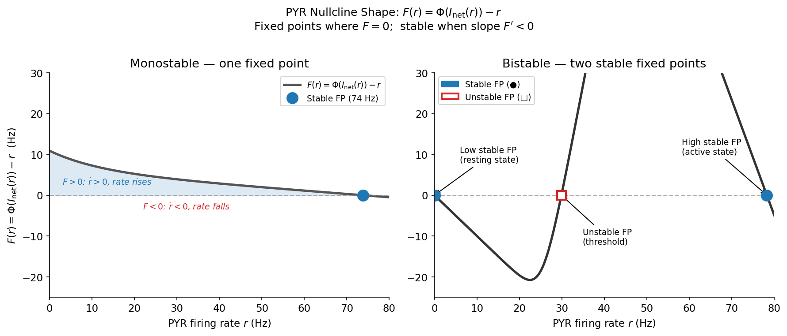

# Bistable Single-Node Optimization: Loss Guide

> **Scope.** This document covers the *single-node bistable optimizer* only (`optimize --mode bistable`).
> The ring-level joint optimizer (`ring-optimize`) is a separate system described in [ring_attractor.md §10](ring_attractor.md#10-joint-ring--circuit-optimization).

---

## Table of Contents

1. [What Are We Optimizing, and Why?](#1-what-are-we-optimizing-and-why)
2. [The PYR Nullcline — Geometric Foundation](#2-the-pyr-nullcline--geometric-foundation)
3. [Before: Original Loss](#3-before-original-loss)
4. [After: Current Loss](#4-after-current-loss)
   - [4.1 L_bistab — Sign-Pattern Enforcement](#41-l_bistab--sign-pattern-enforcement)
   - [4.2 L_rate — Low Fixed-Point Rate Matching](#42-l_rate--low-fixed-point-rate-matching)
   - [4.3 L_rate_high — High Fixed-Point Rate Matching](#43-l_rate_high--high-fixed-point-rate-matching)
   - [4.4 L_margin — Fixed-Point Separation](#44-l_margin--fixed-point-separation)
   - [4.5 L_jac — Jacobian Regularizer](#45-l_jac--jacobian-regularizer)
   - [4.6 L_peak — Nullcline Peak Penalty (optional)](#46-l_peak--nullcline-peak-penalty-optional)
5. [Total Loss Formula & Default Weights](#5-total-loss-formula--default-weights)
6. [Summary Table: Before vs After](#6-summary-table-before-vs-after)

---

## 1. What Are We Optimizing, and Why?

The model has four neural populations: **PYR** (excitatory pyramidal), **PV**, **SOM**, **VIP** (inhibitory interneurons). Their firing rates at steady state define the operating point of the circuit.

**Goal:** Find circuit parameters such that the network is **bistable** — it has two stable resting states:

| State | Biological meaning | Target rates (Rooy 2021) |
|---|---|---|
| **Low (L)** | Spontaneous / resting activity | PYR≈1.75, SOM≈1.12, PV≈1.04, VIP≈1.33 Hz |
| **High (H)** | Persistent / memory-active state | PYR≈60.2, SOM≈35.2, PV≈35.3, VIP≈68.8 Hz |

A transient cue flips the network from L → H. The network then *self-sustains* in H without external input. That self-sustaining property — a persistent attractor — is the neural correlate of working memory.

**Why single-node first?** Ring-level bistability analysis is expensive (full simulation per candidate). The single-node nullcline check (analytical, ~ms) serves as a fast proxy: if the node is not bistable in isolation, the ring will not self-sustain either.

---

## 2. The PYR Nullcline — Geometric Foundation

The dynamics of the PYR firing rate are governed by:

$$\tau_s \, \dot{r}_\text{PYR} = -r_\text{PYR} + \Phi_\text{PYR}(I_\text{net}(r_\text{PYR}))$$

At steady state, $\dot{r} = 0$, so $r^* = \Phi_\text{PYR}(I_\text{net}(r^*))$.

We define:
$$F(r) = \Phi_\text{PYR}(I_\text{net}(r)) - r$$

Zeros of $F$ are fixed points. Stability: $F'(r^*) < 0$ → **stable**; $F'(r^*) > 0$ → **unstable**.

**Key:** $I_\text{net}(r)$ includes the NMDA gating variable $S^*(r) = \frac{\gamma \tau r}{1+\gamma\tau r}$ (which saturates), plus all interneuron feedback solved self-consistently at each $r$.

### Monostable vs Bistable Nullcline



For bistability we need **exactly this sign pattern**:

$$F(r): \quad \underbrace{+}_{\text{low basin}} \xrightarrow{\text{low FP}} \underbrace{-}_{\text{valley}} \xrightarrow{\text{unstable FP}} \underbrace{+}_{\text{high basin}} \xrightarrow{\text{high FP}} \underbrace{-}_{\text{after}}$$

- $F > 0$ before the low FP → low state is attracting
- $F < 0$ in the valley → unstable branch separating the two states
- $F > 0$ in the high basin → high state is attracting
- $F < 0$ after the high FP → high state is stable (not a transient bump)

---

## 3. Before: Original Loss

The original loss had **7 terms**, several of which were redundant or solving the wrong problem.

### 3.1 Old `L_bistab` — Overcomplicated Sign Check

The original implementation used 3 probe points **plus 4 zone penalties**:

```python
# Three probe points
L_3pt = relu(-F_low) + relu(F_mid) + relu(-F_high)

# Zone penalties (attempt at robustness to probe point placement)
L_zone1 = mean(max(-F[r ≤ r_low],  0))    # F should be ≥ 0 in low zone
L_zone2 = relu(max( F[r_low<r≤r_high]))   # F must go negative somewhere in middle
L_zone3 = mean(max(-F[r > r_high], 0))    # F should be ≥ 0 in high zone

L_bistab = L_3pt + L_zone1 + L_zone2 + L_zone3
```

**Bug:** `r_low_target` was used as *both* the low FP rate target *and* the sign-check probe. If the optimizer found a valid bistable solution with the low FP slightly below the target (e.g., FP at 1.5 Hz when target is 1.75 Hz), the probe landed to the right of the FP where $F < 0$ — and was incorrectly penalized, pushing the optimizer away from valid solutions.

### 3.2 `L_ceiling` — High FP Upper Cap

```
L_ceiling = relu(r_high_fp - r_high_max)²     # r_high_max = 80 Hz
```

Prevented the high FP from drifting above the physiological ceiling. Bundled with `L_bistab` under the same weight.

### 3.3 `L_physiol` — Interneuron Sweep Ceiling

Applied soft ceilings on SOM (50 Hz), PV (100 Hz), VIP (80 Hz) across the *entire* sweep, not just at the fixed points:

```
L_physiol = mean(relu(r_SOM - 50)²) + mean(relu(r_PV - 100)²) + mean(relu(r_VIP - 80)²)
```

This was a blunt instrument to prevent pathological interneuron rates in the transition zone. It did not constrain where the rates actually needed to land — the high fixed point had no explicit targets.

### 3.4 What was missing: high-state rate constraints

With no explicit rate targets at the high FP, the optimizer found VIP-disinhibitory bistability where SOM was fully silenced in the high state:

| Population | Found by optimizer | Rooy 2021 target |
|---|---|---|
| PYR | ~70–80 Hz | 60.2 Hz |
| **SOM** | **~0 Hz** | **35.2 Hz ❌** |
| **PV** | **~4 Hz** | **35.3 Hz ❌** |
| VIP | ~65 Hz | 68.8 Hz |

### 3.5 Old default weights

| Term | Weight |
|---|---|
| `L_bistab + L_ceiling` | `w_bistab = 1.0` |
| `L_rate` (low FP) | `w_rate = 1.0` |
| `L_margin` | `w_margin = 0.5` |
| `L_jac` | `w_jacobian = 0.1` |
| `L_physiol` | `w_physiol = 1.0` |
| `L_peak` | `w_peak = 0.0` (off) |

---

## 4. After: Current Loss

Source: [`circuit_model/bistable_loss.py`](../circuit_model/bistable_loss.py)

The loss is computed by:
1. Sweeping $r \in [0, 80]$ Hz, solving interneurons self-consistently at each point
2. Building the NMDA steady-state $S^*(r)$ and computing $F(r)$
3. Evaluating the 6 penalties below

**Removed:** `L_ceiling` (superseded by `L_rate_high` which already pulls the high FP to 60 Hz), `L_physiol` (replaced by explicit rate targets at both FPs).

---

### 4.1 `L_bistab` — Adaptive Sign-Pattern Enforcement

**No fixed probe or split parameters.** The check adapts to wherever the low FP actually lands during optimization. It has four sub-terms:

#### Part 1 — Adaptive low basin

```python
# Find the actual low FP: first r where F crosses 0 going downward (+→-)
down_cross_idx = np.where(np.diff(np.sign(F)) < 0)[0]
r_low_actual = r_sweep[down_cross_idx[0]]   # if no crossing: fall back to r_low_target

# F must be > 0 throughout [0, r_low_actual]
F_max_low_basin = max(F[r ≤ r_low_actual])

# Penalty scales with how far the actual FP is from its target
fp_scale = 1 + |r_low_actual − r_low_target| / r_low_target

L_low_basin = relu(−F_max_low_basin) × fp_scale
```

If the optimizer has not found the low FP yet and it drifts to 70 Hz instead of 1.75 Hz:
- the whole region [0, 70 Hz] must be positive
- the penalty is ≈ 40× larger than when the FP sits at target
- this creates a strong coupled gradient: *both* `L_bistab` and `L_rate` push the FP toward its target simultaneously

#### Part 2 — Full sign pattern (+, −, +, −)

Three conditions after the low FP enforce the complete bistable shape:

```python
F_after = F[r > r_low_actual]

# 2a: F must go negative — valley exists → unstable FP will be created
L_valley = relu(min(F_after))

# 2b: F must be ≥ f_high_margin above zero inside the target high-state window.
#     Window = [r_pyr_high_target × lo_frac, r_pyr_high_target × hi_frac]
#              = [60.2 × 0.7, 60.2 × 1.2] = [42, 72] Hz by default.
#     Using a windowed max (not global) prevents satisfying this condition with
#     a spurious low-rate bump (e.g., a crossing at 17 Hz scores full penalty).
r_hb_lo = r_pyr_high_target × r_high_basin_lo_frac   # default 42 Hz
r_hb_hi = r_pyr_high_target × r_high_basin_hi_frac   # default 72 Hz
F_max_hb = max(F[r_hb_lo < r ≤ r_hb_hi])
L_high_basin = relu(f_high_margin − F_max_hb)        # default f_high_margin = 1.0 Hz

# 2c: F < 0 at the far end of the sweep — high FP is stable, not just a bump
F_tail = F[r ≥ 0.85 × r_max]
L_tail = relu(max(F_tail))
```

```
 F(r)
  ▲   Part 1                   Part 2
  │  ←low basin→ ←─ valley ─→ ←── window [42,72] ──→ ← tail →
  │
  │ ++++++.                          .+++++++
  │       `.                      .+'         `.
 ─┼────────`───────────────────── '─────────────`────→ r
  │         ↑                     ↑              ↑
  │       low FP             unstable FP       high FP
  │       (detected,         (unconstrained)   (must be in window)
  │        ~1.75 Hz target)
```

- `L_valley = 0` once F dips negative anywhere after the low FP
- `L_high_basin = 0` once F is at least `f_high_margin` (1 Hz) above zero inside [42, 72] Hz — a 17 Hz spurious crossing scores ≈ 52 penalty
- `L_tail = 0` once F is negative in the final 15% of the sweep (r > 68 Hz)
- **`L_valley + L_high_basin + L_tail = 0`** iff the full $+, -, +, -$ pattern holds with the crossing near target

The unstable FP position is **not directly constrained** — it follows implicitly when 2a and 2b are both satisfied.

**Total:**

$$L_\text{bistab} = L_\text{low basin} + L_\text{valley} + L_\text{high basin} + L_\text{tail}$$

**What goes wrong without it:** The optimizer finds monostable solutions without penalty — no self-sustaining memory.

---

### 4.2 `L_rate` — Low Fixed-Point Rate Matching

**Unchanged from original.** Evaluated at the *lowest* stable fixed point found by the Brentq root-finder.

$$L_\text{rate} = \left(\frac{r_\text{PYR}^\text{low} - r_\text{PYR}^\text{target}}{r_\text{PYR}^\text{target}}\right)^2 + \left(\frac{r_\text{SOM}^\text{low} - r_\text{SOM}^\text{target}}{r_\text{SOM}^\text{target}}\right)^2 + \left(\frac{r_\text{PV}^\text{low} - r_\text{PV}^\text{target}}{r_\text{PV}^\text{target}}\right)^2 + \left(\frac{r_\text{VIP}^\text{low} - r_\text{VIP}^\text{target}}{r_\text{VIP}^\text{target}}\right)^2$$

Default targets: **PYR=1.75, SOM=1.12, PV=1.04, VIP=1.33 Hz** (CLI: `--target_pyr`, `--target_som`, `--target_pv`, `--target_vip`).

This is **MSPE**: a 1 Hz miss at 1.75 Hz target costs far more than 1 Hz at 60 Hz, which makes sense — relative deviations matter biologically.

**What goes wrong without it:** Bistability achieved with biologically absurd resting states (PYR=0, all interneurons hyperactive).

---

### 4.3 `L_rate_high` — High Fixed-Point Rate Matching

**New.** Symmetric to `L_rate`, evaluated at the highest stable fixed point.

$$L_\text{rate,high} = \left(\frac{r_\text{PYR}^\text{high} - r_\text{PYR}^\text{H}}{r_\text{PYR}^\text{H}}\right)^2 + \left(\frac{r_\text{SOM}^\text{high} - r_\text{SOM}^\text{H}}{r_\text{SOM}^\text{H}}\right)^2 + \left(\frac{r_\text{PV}^\text{high} - r_\text{PV}^\text{H}}{r_\text{PV}^\text{H}}\right)^2 + \left(\frac{r_\text{VIP}^\text{high} - r_\text{VIP}^\text{H}}{r_\text{VIP}^\text{H}}\right)^2$$

Default targets: **PYR=60.2, SOM=35.2, PV=35.3, VIP=68.8 Hz** (Rooy 2021, CLI: `--r_pyr_high_target` etc.).

> **When monostable:** no second stable FP exists, so $L_\text{rate,high} = 0$. The bistability terms already apply a heavy penalty in that regime — adding a phantom high-FP penalty would give a misleading gradient.

**What it fixes:** Eliminates the VIP-disinhibitory degenerate solution (SOM=0, PV=4 Hz in the high state) by adding explicit pressure toward SOM≈35 Hz and PV≈35 Hz.

---

### 4.4 `L_margin` — Fixed-Point Separation

**Formula unchanged; default weight increased from 0.5 → 2.0.**

$$L_\text{margin} = \text{relu}\!\left(\Delta r_\text{min} - (r_\text{high stable} - r_\text{low stable})\right), \quad \Delta r_\text{min} = 15 \text{ Hz}$$

When **monostable**: $L_\text{margin} = 2 \times \Delta r_\text{min} = 30$ (strong fixed penalty).

```
 Δr = 5 Hz  →  L_margin = relu(15 - 5)  = 10   ← too close
 Δr = 60 Hz →  L_margin = relu(15 - 60) =  0   ← OK
```

**What goes wrong without it:** Marginal bistability with barely distinguishable attractors — functionally useless for working memory.

---

### 4.5 `L_jac` — Jacobian Regularizer

**Unchanged.**

$$L_\text{jac} = \text{relu}\!\left(\max_{i,j} |J_{ij}| - 5.0\right)^2$$

The 4×4 Jacobian is evaluated at the low fixed point. The threshold of 5 means: *1 Hz increase in population $j$ changes population $i$ by at most 5 Hz*.

**What goes wrong without it:** Degenerate solutions where one overwhelmingly dominant pathway (e.g., PV→PYR) creates bistability via an implausible mechanism, rather than the intended multi-pathway disinhibitory circuit.

---

### 4.6 `L_peak` — Nullcline Peak Penalty (optional, default off)

**Unchanged.**

$$L_\text{peak} = \text{relu}\!\left(\max_r \Phi(I_\text{net}(r)) - r_\text{peak,max}\right)^2 \qquad \text{default: } r_\text{peak,max} = 200 \text{ Hz (effectively off)}$$

Prevents the nullcline from peaking far above the high FP, which causes the network to overshoot badly during the L→H transition (cue-period saturation).

Enable with `--w_peak 1.0 --nullcline_peak_max 95` in the CLI.

---

## 5. Total Loss Formula & Default Weights

```python
L_total = w_bistab    * L_bistab       # adaptive sign-pattern (4 sub-terms, no fixed probes)
        + w_rate      * L_rate         # low FP rates
        + w_rate_high * L_rate_high    # high FP rates  (0 when monostable)
        + w_margin    * L_margin       # FP separation
        + w_jacobian  * L_jac          # Jacobian regularizer
        + w_peak      * L_peak         # nullcline peak (off by default)
```

| Component | Default weight | Active |
|---|---|---|
| `L_bistab` (4 sub-terms, adaptive) | `w_bistab = 5.0` | Yes |
| `L_rate` (low FP) | `w_rate = 1.0` | Yes |
| `L_rate_high` (high FP) | `w_rate_high = 1.5` | Yes (only when bistable) |
| `L_margin` | `w_margin = 2.0` | Yes |
| `L_jac` | `w_jacobian = 0.1` | Yes |
| `L_peak` | `w_peak = 0.0` | **No (off)** |

### What the optimizer minimizes (step by step)

```
Step 1:  F(r) has full (+,−,+,−) sign pattern         ←  L_bistab
           ↓ if bistable
Step 2:  Two stable FPs separated by ≥ 15 Hz          ←  L_margin
           ↓
Step 3:  Low FP matches resting-state rates            ←  L_rate (coupled with L_bistab scale)
           ↓
Step 4:  High FP matches active-state rates            ←  L_rate_high
           ↓
Step 5:  No single pathway dominates implausibly       ←  L_jac
           ↓
Step 6:  (Optional) control overshoot at transition    ←  L_peak
```

---

## 6. Summary Table: Before vs After

| Loss term | Before | After | Change |
|---|---|---|---|
| `L_bistab` | 7 sub-terms (3 probes + 4 zone penalties), `w=1.0` | 4 sub-terms (adaptive low + valley + windowed high + tail), `w=5.0` | **Redesigned** — probe-free, windowed |
| Bistability check params | `r_low_probe`, `r_mid_probe`, `r_high_probe` (placement-sensitive) | `f_high_margin=1.0`, `r_high_basin_lo_frac=0.7`, `r_high_basin_hi_frac=1.2` (optional shape tuning) | 3 placement params → 3 shape params |
| `L_ceiling` | ✅ bundled with L_bistab | **❌ removed** | Superseded by L_rate_high |
| `L_physiol` (sweep ceiling) | ✅ `w=1.0` | **❌ removed** | Replaced by L_rate_high |
| `L_rate` (low FP) | ✅ `w=1.0` | ✅ `w=1.0` | Unchanged |
| `L_rate_high` (high FP) | **❌ missing** | **✅ added, `w=1.5`** | Main addition |
| `L_margin` | ✅ `w=0.5` | ✅ `w=2.0` | Weight raised |
| `L_jac` | ✅ `w=0.1` | ✅ `w=0.1` | Unchanged |
| `L_peak` | ✅ off by default | ✅ off by default | Unchanged |
| **Total terms** | **7** | **6** | Simpler, more targeted |

**Net effect:** Both stable states are now explicitly constrained. The bistability check requires no probe placement — the low-basin boundary adapts to the detected FP, and the high-basin check is anchored to the target rate window, preventing spurious low-rate solutions from scoring zero penalty.

---

*Last updated: 2026-04-17*
