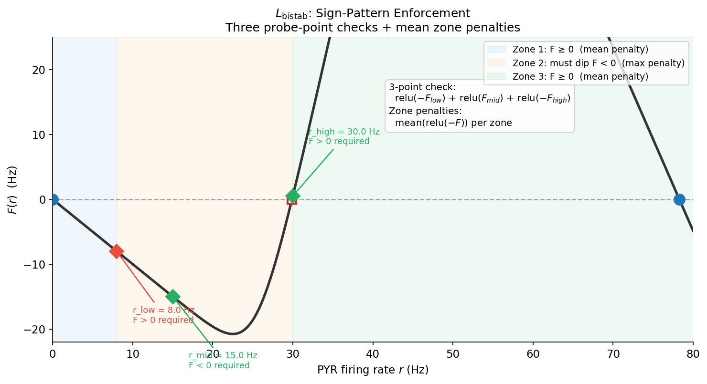
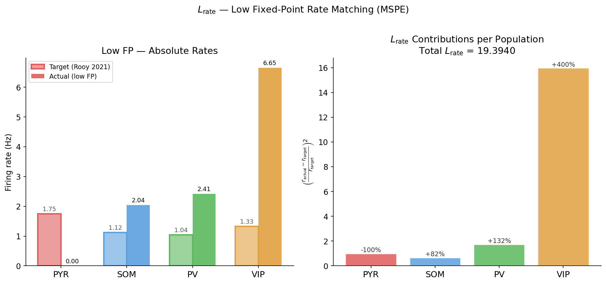
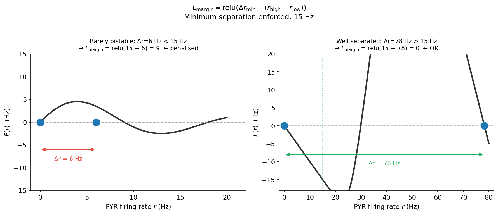
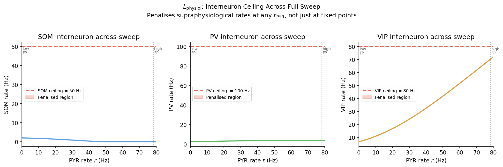
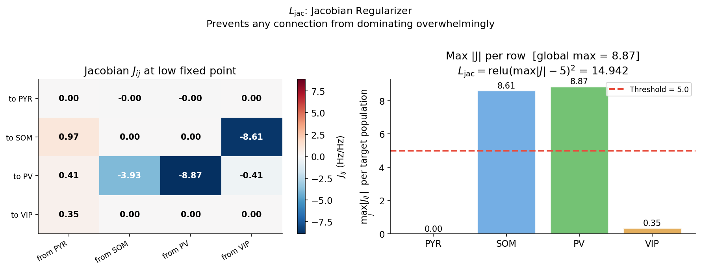
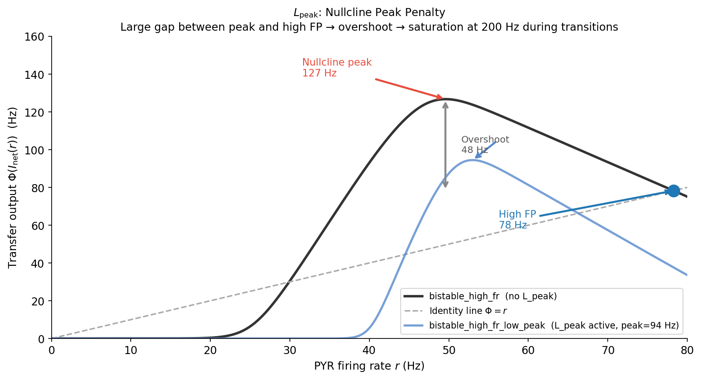
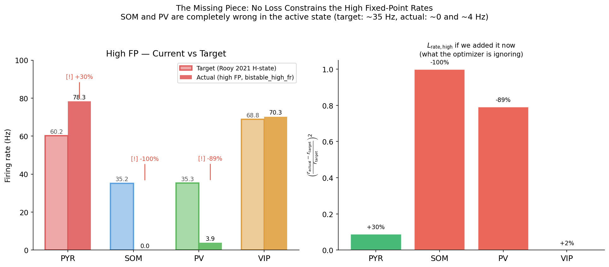
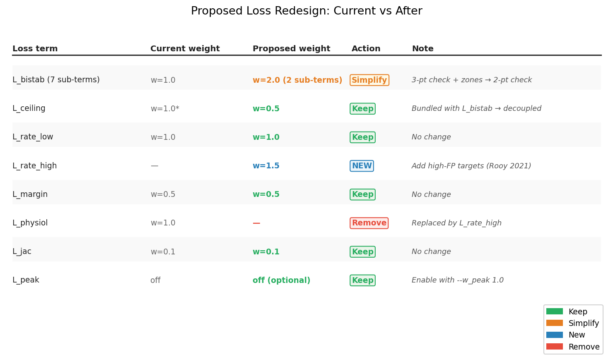

# Bistable Single-Node Optimization: Loss Guide

> **Scope.** This document covers the *single-node bistable optimizer* only (`optimize --mode bistable`).
> The ring-level joint optimizer (`ring-optimize`) is a separate system described in [ring_attractor.md §10](ring_attractor.md#10-joint-ring--circuit-optimization).

---

## Table of Contents

1. [What Are We Optimizing, and Why?](#1-what-are-we-optimizing-and-why)
2. [The PYR Nullcline — Geometric Foundation](#2-the-pyr-nullcline--geometric-foundation)
3. [Current Loss Components](#3-current-loss-components)
   - [3.1 L_bistab — Sign-Pattern Enforcement](#31-l_bistab--sign-pattern-enforcement)
   - [3.2 L_rate — Low Fixed-Point Rate Matching](#32-l_rate--low-fixed-point-rate-matching)
   - [3.3 L_margin — Fixed-Point Separation](#33-l_margin--fixed-point-separation)
   - [3.4 L_ceiling — High Fixed-Point Cap](#34-l_ceiling--high-fixed-point-cap)
   - [3.5 L_physiol — Interneuron Sweep Ceiling](#35-l_physiol--interneuron-sweep-ceiling)
   - [3.6 L_jac — Jacobian Regularizer](#36-l_jac--jacobian-regularizer)
   - [3.7 L_peak — Nullcline Peak Penalty (optional)](#37-l_peak--nullcline-peak-penalty-optional)
4. [Total Loss Formula & Default Weights](#4-total-loss-formula--default-weights)
5. [The Missing Piece: High-State Rate Constraints](#5-the-missing-piece-high-state-rate-constraints)
6. [Proposed Simplified Loss](#6-proposed-simplified-loss)
7. [Summary Table: Before vs After](#7-summary-table-before-vs-after)

---

## 1. What Are We Optimizing, and Why?

The model has four neural populations: **PYR** (excitatory pyramidal), **PV**, **SOM**, **VIP** (inhibitory interneurons). Their firing rates at steady state define the operating point of the circuit.

**Goal:** Find circuit parameters such that the network is **bistable** — it has two stable resting states:

| State | Biological meaning | Target rates (Rooy 2021) |
|---|---|---|
| **Low (L)** | Spontaneous / resting activity | PYR≈1.75, SOM≈1.12, PV≈1.04, VIP≈1.33 Hz |
| **High (H)** | Persistent / memory-active state | PYR≈60.2, SOM≈35.2, PV≈35.3, VIP≈68.8 Hz |

A transient cue flips the network from L → H. The network then *self-sustains* in H without external input. That self-sustaining property — a persistent attractor — is the neural correlate of working memory.

**Why single-node first?** Ring-level bistability analysis is expensive (full simulation per candidate). The single-node nullcline check (analytical, ~ms) serves as a fast proxy: if the node is not bistable in isolation, the ring will not self-sustain either.

---

## 2. The PYR Nullcline — Geometric Foundation

The dynamics of the PYR firing rate are governed by:

$$\tau_s \, \dot{r}_\text{PYR} = -r_\text{PYR} + \Phi_\text{PYR}(I_\text{net}(r_\text{PYR}))$$

At steady state, $\dot{r} = 0$, so $r^* = \Phi_\text{PYR}(I_\text{net}(r^*))$.

We define:
$$F(r) = \Phi_\text{PYR}(I_\text{net}(r)) - r$$

Zeros of $F$ are fixed points. Stability: $F'(r^*) < 0$ → **stable**; $F'(r^*) > 0$ → **unstable**.

**Key:** $I_\text{net}(r)$ includes the NMDA gating variable $S^*(r) = \frac{\gamma \tau r}{1+\gamma\tau r}$ (which saturates), plus all interneuron feedback solved self-consistently at each $r$.

### Monostable vs Bistable Nullcline


For bistability we need **exactly this sign pattern**:
- $F(r_\text{low}) > 0$ — nullcline above identity near the low FP → low state is attracting
- $F(r_\text{mid}) < 0$ — nullcline dips below identity in the middle → unstable branch separating states
- $F(r_\text{high}) > 0$ — nullcline above identity near the high FP → high state is attracting

---

## 3. Current Loss Components

Source: [`circuit_model/bistable_loss.py`](../circuit_model/bistable_loss.py)

The loss is computed by:
1. Sweeping $r \in [0, 80]$ Hz, solving interneurons self-consistently at each point
2. Building the NMDA steady-state $S^*(r)$ and computing $F(r)$
3. Evaluating all penalties below

---

### 3.1 `L_bistab` — Sign-Pattern Enforcement

**Purpose:** Force the nullcline into the bistable shape shown above.

**Intuition:**

```
 F(r)
  ▲
  │   ←Zone1→     ←Zone2(must dip<0)→    ←Zone3→
  │
  │+++++++.   ← reward: F positive here        +++
  │        `. ← zone2: penalise if never <0 .'
 ─┼──────────`────────────────────────────'─────→ r
  │          `. (must go negative here!)  ↑ r_high
  │  r_low→  ↑  `──────────────────────'
  │         r_mid (probe: must be <0 here)
```



**Formula** (from code):

```python
# Three probe points
L_3pt = relu(-F_low) + relu(F_mid) + relu(-F_high)

# Zone penalties (robustness to probe point placement)
L_zone1 = mean(max(-F[r ≤ r_low],  0))    # F should be ≥ 0 in low zone
L_zone2 = relu(max( F[r_low<r≤r_high]))   # F must go negative somewhere in middle
L_zone3 = mean(max(-F[r > r_high], 0))    # F should be ≥ 0 in high zone

L_bistab = L_3pt + L_zone1 + L_zone2 + L_zone3
```

**Default probe points:** `r_low_target=8`, `r_mid_probe=15`, `r_high_target=30` Hz.
**What goes wrong without it:** The optimizer finds any monostable solution (one FP) without penalty, which cannot sustain memory.

> `r_high_target` here is only the probe for checking the sign of $F$ — it is **not** a constraint on where the actual high FP ends up. This is the source of the missing high-state rate matching (see §5).

---

### 3.2 `L_rate` — Low Fixed-Point Rate Matching

**Purpose:** The low stable FP should match the observed resting-state firing rates.

**Interneuron solving:** For each candidate $r_\text{low FP}$, SOM and PV are solved jointly via `fsolve` (two coupled equations including SOM adaptation), VIP is solved directly.

**Formula:**
$$L_\text{rate} = \left(\frac{r_\text{PYR}^\text{low} - r_\text{PYR}^\text{target}}{r_\text{PYR}^\text{target}}\right)^2 + \left(\frac{r_\text{SOM}^\text{low} - r_\text{SOM}^\text{target}}{r_\text{SOM}^\text{target}}\right)^2 + \left(\frac{r_\text{PV}^\text{low} - r_\text{PV}^\text{target}}{r_\text{PV}^\text{target}}\right)^2 + \left(\frac{r_\text{VIP}^\text{low} - r_\text{VIP}^\text{target}}{r_\text{VIP}^\text{target}}\right)^2$$

This is **MSPE** (mean squared percentage error): a 1 Hz miss at 1.75 Hz target costs far more than 1 Hz at 60 Hz. This makes sense biologically — relative deviations matter more than absolute ones.

```
 Example: targets = (PYR=1.75, SOM=1.12, PV=1.04, VIP=1.33 Hz)
 
 If optimizer finds: PYR=0.0, SOM=1.2, PV=0.5, VIP=1.5 Hz:
   L_rate = (0/1.75)² + (0.08/1.12)² + (0.54/1.04)² + (0.17/1.33)²
          =    0      +   0.005        +   0.27        +   0.016
          ≈ 0.29     (dominated by PV miss)
```

**What goes wrong without it:** Bistability can be achieved with biologically absurd resting states (e.g. PYR=0, all interneurons hyperactive). The optimizer consistently finds such degenerate solutions otherwise.



---

### 3.3 `L_margin` — Fixed-Point Separation

**Purpose:** The two stable FPs should be well separated. A barely bistable circuit with low FP at 0 Hz and high FP at 2 Hz is biologically meaningless.

**Formula:**
$$L_\text{margin} = \text{relu}\!\left(\Delta r_\text{min} - (r_\text{high stable} - r_\text{low stable})\right)$$

where $\Delta r_\text{min} = 15$ Hz by default.

```
 Example:
                 ← Δr = 5 Hz →        L_margin = relu(15 - 5) = 10   ← BAD
   low FP = 0 Hz              high FP = 5 Hz

                 ← Δr = 60 Hz →       L_margin = relu(15 - 60) = 0   ← OK
   low FP = 0 Hz                                      high FP = 60 Hz
```

If the network is **monostable** (fewer than 2 stable FPs), the code sets $L_\text{margin} = 2 \times \Delta r_\text{min} = 30$, a strong additional penalty.

**What goes wrong without it:** The optimizer finds marginal bistability where the two attractors are barely distinguishable — functionally useless for memory.



---

### 3.4 `L_ceiling` — High Fixed-Point Cap

**Purpose:** Prevent the high FP from being pushed above the physiological ceiling ($r_\text{high max} = 80$ Hz, from `constants.py`).

**Formula:**
$$L_\text{ceiling} = \text{relu}\!\left(r_\text{high FP} - r_\text{high max}\right)^2 \qquad \text{(only when bistable)}$$

```
 r_high_max = 80 Hz
 
 r_high = 78 Hz  →  L_ceiling = relu(78-80)² = 0        ← OK
 r_high = 95 Hz  →  L_ceiling = relu(95-80)² = 225       ← penalised
```

**Combined with `L_bistab` in total loss:**
Both are multiplied by `w_bistab`, because they jointly define the bistable geometric constraints.

**What goes wrong without it:** The optimizer finds bistability by placing the high FP near or above 200 Hz (the simulation clamp ceiling), creating spurious solutions that don't correspond to real attractors.

---

### 3.5 `L_physiol` — Interneuron Sweep Ceiling

**Purpose:** Prevent interneurons from reaching pathological rates across the **entire sweep** from $r=0$ to $r=80$ Hz, not just at the fixed points.

**Motivation:** Earlier runs showed SOM saturating at 150–200 Hz in the *intermediate* regime between the low and unstable FPs, which is biologically implausible. This penalty is a soft ceiling applied at every point of the sweep.

**Formula:**
$$L_\text{physiol} = \underbrace{\langle\text{relu}(r_\text{SOM} - 50)^2\rangle_\text{sweep}}_\text{SOM ceiling: 50 Hz} + \underbrace{\langle\text{relu}(r_\text{PV} - 100)^2\rangle_\text{sweep}}_\text{PV ceiling: 100 Hz} + \underbrace{\langle\text{relu}(r_\text{VIP} - 80)^2\rangle_\text{sweep}}_\text{VIP ceiling: 80 Hz}$$

where $\langle \cdot \rangle_\text{sweep}$ is the mean over the 1000-point sweep.

```
 Example: SOM reaches 159 Hz in the transition zone (as in bistable_fixed run)

   r_SOM in transition zone: [2, 10, 40, 90, 159, 130, 40, 5, 0]  Hz
   SOM ceiling = 50 Hz
   
   Penalties: [0, 0, 0, relu(40)²=1600, relu(109)²=11881, relu(80)²=6400, 0, 0, 0]
   Mean = 2209  ← large penalty, correctly flags this as pathological
```

**What goes wrong without it:** Extreme SOM/VIP/PV rates in the transition zone that would cause the network to behave pathologically when traversing state boundaries.

**Limitation:** This is a *ceiling*, not a *target*. It prevents runaway but does not ensure physiological values at the high FP. See §5.



---

### 3.6 `L_jac` — Jacobian Regularizer

**Purpose:** Prevent solutions where one pathway dominates overwhelmingly (e.g. PV→PYR weight so large it creates a single all-inhibitory loop). Biologically, no synaptic gain should be so high that 1 Hz of additional firing in one population changes another by more than 5 Hz.

**How the Jacobian is computed:** The 4×4 Jacobian $J_{ij} = \partial \dot{r}_i / \partial r_j$ is evaluated at the low fixed point using `compute_jacobian(params, r_ss)`.

**Formula:**
$$L_\text{jac} = \text{relu}\!\left(\max_{i,j} |J_{ij}| - 5.0\right)^2$$

```
 Example Jacobian at low FP (hypothetical):
 
          PYR   SOM    PV   VIP
 PYR  [  2.1  -3.0  -4.8   0.1 ]
 SOM  [  1.2  -0.5   0.0  -1.1 ]
 PV   [  0.9   0.0  -0.2   0.0 ]
 VIP  [  0.3   0.0   0.0  -0.1 ]
 
 max|J| = 4.8  →  L_jac = relu(4.8 - 5)² = 0   ← OK, within bounds
 
 If PYR→PV weight was inflated: max|J| = 12.0 → L_jac = (12-5)² = 49  ← penalised
```

The threshold of 5 means: *1 Hz increase in population $j$ can change population $i$ by at most 5 Hz*. This is already a generous bound biologically.

**What goes wrong without it:** The optimizer may find degenerate solutions where one extremely strong connection creates bistability via an implausibly dominant pathway, rather than through the intended multi-pathway disinhibitory mechanism.



---

### 3.7 `L_peak` — Nullcline Peak Penalty (optional, default off)

**Purpose:** Prevent the nullcline from peaking far above the high FP. A large gap between peak and high FP causes the network to overshoot badly during transitions (→ cue-period saturation at 200 Hz).

**Formula:**
$$L_\text{peak} = \text{relu}\!\left(\max_r \Phi(I_\text{net}(r)) - r_\text{peak,max}\right)^2 \qquad \text{default: } r_\text{peak,max} = 200 \text{ (off)}$$

```
 Nullcline shape:

       Φ(I_net(r))                  Φ(I_net(r))
  ▲                             ▲
  │     ✱ peak=124 Hz            │   ✱ peak=92 Hz ← L_peak controls this
  │   ./ \.                      │  ./  \.
  │  /    \  ← high FP           │ /     \  ← high FP
  │ /      \  at 78 Hz           │/       \  at 66 Hz
  │/         .                   │          .
 ─┼──────────→ r              ───┼──────────→ r
  │                              │
  Peak/FP ratio = 1.59×           Peak/FP ratio = 1.40×
  → large overshoot              → less overshoot
```

**Practical use:** Set `--w_peak 1.0 --nullcline_peak_max 95` in the CLI. This was found to reduce (but not eliminate) cue-period saturation in ring simulations.

**Alternative:** Using low-rate targets (r_low ≈ 1.75 Hz) implicitly pushes the peak down, as documented in [new_observation.md](new_observation.md) (2026-04-14).



---

## 4. Total Loss Formula & Default Weights

```
L_total = w_bistab * (L_bistab + L_ceiling)
        + w_rate   *  L_rate
        + w_margin *  L_margin
        + w_jac    *  L_jac
        + w_physiol * L_physiol
        + w_peak   *  L_peak
```

| Component | Default weight | Currently active |
|---|---|---|
| `L_bistab + L_ceiling` | `w_bistab = 1.0` | Yes |
| `L_rate` (low FP) | `w_rate = 1.0` | Yes |
| `L_margin` | `w_margin = 0.5` | Yes |
| `L_jac` | `w_jacobian = 0.1` | Yes |
| `L_physiol` | `w_physiol = 1.0` | Yes |
| `L_peak` | `w_peak = 0.0` | **No (off)** |

### What the optimizer actually minimizes (as a workflow)

```
Step 1:  Find parameters where F(r) has the right sign pattern  ←  L_bistab
           ↓ if bistable
Step 2:  Push both stable FPs away from each other            ←  L_margin
           ↓
Step 3:  Match resting-state firing rates at the low FP       ←  L_rate
           ↓
Step 4:  Keep the solution physiologically plausible          ←  L_jac, L_physiol, L_ceiling
           ↓
Step 5:  (Optional) control overshoot during transition       ←  L_peak
           ↓
         ❌ NOTHING constrains the high FP rates!
```

---

## 5. The Missing Piece: High-State Rate Constraints

### What the optimizer currently finds

With the current loss, the optimizer successfully achieves:
- ✅ Bistable nullcline geometry
- ✅ Low FP rates roughly matching resting-state targets
- ✅ Physiological interneuron ceilings
- ✅ Reasonable Jacobian gains

But at the **high fixed point**, there are no rate targets. The optimizer is free to pick any configuration that satisfies the geometry constraints. The result, observed consistently across all runs:

| Population | High FP (ring simulation) | Target (Rooy 2021) | Status |
|---|---|---|---|
| PYR | ~70–80 Hz | ~60 Hz | ≈ OK |
| **SOM** | **~0 Hz** | **35.2 Hz** | **❌ completely wrong** |
| **PV** | **~4 Hz** | **35.3 Hz** | **❌ far too low** |
| VIP | ~60–70 Hz | 68.8 Hz | ≈ OK |

### Why the optimizer finds SOM = 0 in the high state

The bistable mechanism in the current solution is **VIP-disinhibitory**: the cue activates VIP, which suppresses SOM via w_VS, which releases PYR from SOM-mediated inhibition. This is biologically correct for the *transition*, but in the self-sustained high state, VIP remains elevated (~70 Hz), keeping SOM fully suppressed.

The loss offers no incentive to bring SOM back to 35 Hz in the high state — so the optimizer never does.

```
Bistable mechanism found by optimizer:
                                              
  LOW state:   PYR ≈ 0 Hz                    
               SOM ≈ 2 Hz ──(inhibits)──→ PYR (keeps it silent)
               VIP ≈ 2 Hz                    

  Cue:         VIP ↑↑ (driven by cue)         
               VIP ──(suppresses)──→ SOM ↓   
               SOM suppression removes block on PYR
               
  HIGH state:  PYR ≈ 75 Hz (self-sustained via NMDA)
               SOM ≈ 0 Hz  (VIP keeps it fully silent)   ← biologically wrong
               PV  ≈ 4 Hz  (driven by PYR but weak)      ← biologically wrong
               VIP ≈ 65 Hz (high, maintaining SOM silence)
```

This mechanism produces correct bistability but the wrong high-state interneuron configuration. According to Rooy (2021), SOM should be active at ~35 Hz and PV at ~35 Hz during the high state.



---

## 6. Proposed Simplified Loss

### Design principles

1. **Two rate targets, not one.** Match firing rates at *both* stable fixed points. This is the main missing piece.
2. **Geometry check, not zone micromanagement.** Replace the complex 7-penalty L_bistab with a simpler check: "does a second stable FP exist beyond the first?" Rate losses provide most of the implicit geometric pressure once both states are targeted.
3. **Drop L_physiol.** Once we have explicit rate targets at both FPs, the physiology is constrained where it matters. The sweep ceiling is a blunt instrument that poorly compensates for missing point targets.
4. **Keep L_margin, L_jac, L_peak.** These remain useful as regulators.

### New `L_rate_high`

Symmetric to `L_rate`, evaluated at the high stable fixed point:

$$L_\text{rate,high} = \left(\frac{r_\text{PYR}^\text{high} - r_\text{PYR}^\text{H-target}}{r_\text{PYR}^\text{H-target}}\right)^2 + \left(\frac{r_\text{SOM}^\text{high} - r_\text{SOM}^\text{H-target}}{r_\text{SOM}^\text{H-target}}\right)^2 + \left(\frac{r_\text{PV}^\text{high} - r_\text{PV}^\text{H-target}}{r_\text{PV}^\text{H-target}}\right)^2 + \left(\frac{r_\text{VIP}^\text{high} - r_\text{VIP}^\text{H-target}}{r_\text{VIP}^\text{H-target}}\right)^2$$

where $r^\text{H-target}$ comes from Rooy (2021): **PYR=60.2, SOM=35.2, PV=35.3, VIP=68.8 Hz**.

> **Important:** This term is only meaningful when the network is bistable (second stable FP exists). When monostable, $r_\text{high}$ is undefined and this term should be set to 0 — the bistability constraint (`L_bistab`) already applies a heavy penalty in that case.

### Simplified `L_bistab`

The current `L_bistab` has 7 sub-terms (3 probe points + 4 zone penalties). The intent is correct but the implementation is redundant: once we enforce rate matching at both FPs, the sign-pattern zones carry less independent information.

**Proposed replacement:** a minimal two-condition check.

$$L_\text{bistab,simple} = \underbrace{\text{relu}(-F(r_\text{low,target}))}_\text{low FP must attract} + \underbrace{\text{relu}(F(r_\text{mid,probe}))}_\text{unstable branch must exist}$$

This is exactly `L_3pt` without the high-zone term (which is naturally satisfied by `L_rate_high` pulling the high FP to 60 Hz where $F > 0$) and without the zone penalties (which are redundant once both FP rates are penalized).

When monostable, the optimizer gets `L_bistab_simple > 0`, `L_margin = 30`, and `L_rate_high = 0` (inactive). These jointly create a strong gradient toward bistability.

### Proposed total loss

$$\boxed{L_\text{total} = w_b \cdot L_\text{bistab,simple} + w_r \cdot L_\text{rate,low} + w_{rh} \cdot L_\text{rate,high} + w_m \cdot L_\text{margin} + w_j \cdot L_\text{jac} + (w_c \cdot L_\text{ceiling}) + (w_p \cdot L_\text{peak})}$$

where terms in parentheses are optional.

### Proposed default weights

| Term | Proposed weight | Rationale |
|---|---|---|
| `L_bistab_simple` | 2.0 | Stronger than before — it's simpler so needs higher weight to compensate |
| `L_rate_low` | 1.0 | Same as before |
| `L_rate_high` | 1.5 | Slightly higher than low: high state is the harder constraint |
| `L_margin` | 0.5 | Same as before |
| `L_jac` | 0.1 | Same as before |
| `L_ceiling` | 0.5 | Reduced (L_rate_high already pulls high FP down) |
| `L_peak` | 0.0 | Off by default, enable with `--w_peak 1.0 --nullcline_peak_max 95` |
| ~~`L_physiol`~~ | ~~1.0~~ | **Removed** — replaced by explicit L_rate_high targets |

### New `BistableConfig` fields needed

```python
# New fields for high-state targets
r_pyr_high_target: float = 60.2    # PYR rate at high FP (Rooy 2021 H-state)
r_som_high_target: float = 35.2    # SOM rate at high FP
r_pv_high_target:  float = 35.3    # PV rate at high FP
r_vip_high_target: float = 68.8    # VIP rate at high FP
w_rate_high: float = 1.5           # Weight for L_rate_high
```

### Effect on the optimization landscape

```
WITH CURRENT LOSS:

 High FP configuration space (schematic):
 
  SOM at high FP (Hz)
  ▲ 40 │ 
    30 │            ← Rooy target (35 Hz)
    20 │
    10 │
     0 │●←────────────────── optimizer finds this (SOM=0)
       └─────────────────────→ PV at high FP (Hz)
          0   10   20  30  40

WITH PROPOSED LOSS (L_rate_high added):

  SOM at high FP (Hz)
  ▲ 40 │            
    30 │      ✱←─── L_rate_high target zone (~35 Hz)
    20 │
    10 │
     0 │  (cost of SOM=0 now very high)
       └─────────────────────→ PV at high FP (Hz)
          0   10   20  30  40
```

### Open question: architectural feasibility

Adding `L_rate_high` will immediately reveal whether the current network architecture can simultaneously achieve:
- Bistability (two stable FPs)
- Low FP matching resting state (PYR~1.75, SOM~1.12, PV~1.04 Hz)
- High FP matching active state (PYR~60, SOM~35, PV~35 Hz)

The VIP-disinhibitory mechanism naturally silences SOM in the high state. If the optimizer consistently fails even with `L_rate_high` strongly enforced, it means the architecture needs revision:

**Option A** — Allow SOM to receive direct PYR excitation strong enough to re-activate it even with partial VIP suppression (increase `w_es` upper bound).

**Option B** — Add a second disinhibitory pathway or a SOM adaptation mechanism where SOM eventually recovers from VIP suppression on a slow timescale (partial adaptation-induced rebound).

**Option C** — Reconsider whether the Rooy 2021 high-state rates (SOM=35 Hz) are compatible with the VIP-disinhibitory attractor mechanism. It may be that in the biological system, the high state involves *partial* VIP activation (not full silencing of SOM) — which would require re-examining the bistability mechanism itself.

---



## 7. Summary Table: Before vs After

| Loss term | Current | Proposed | Change |
|---|---|---|---|
| `L_bistab` (7 sub-terms) | ✅ `w=1.0` | → Simplified (2 sub-terms), `w=2.0` | Simplified |
| `L_ceiling` | ✅ bundled with L_bistab | ✅ keep, `w=0.5` | Decoupled, reduced weight |
| `L_rate_low` (low FP) | ✅ `w=1.0` | ✅ unchanged | No change |
| `L_rate_high` (high FP) | **❌ missing** | **✅ added `w=1.5`** | **New — main addition** |
| `L_margin` | ✅ `w=0.5` | ✅ unchanged | No change |
| `L_physiol` (sweep ceiling) | ✅ `w=1.0` | **❌ removed** | **Removed** |
| `L_jac` | ✅ `w=0.1` | ✅ unchanged | No change |
| `L_peak` | ✅ off by default | ✅ off by default | No change |

**Net effect:** The loss becomes simpler (7 terms → 6 terms, one of them new), more targeted (both states explicitly constrained), and less redundant (no soft ceiling that partially overlapped with rate matching).

---

*Last updated: 2026-04-16*
