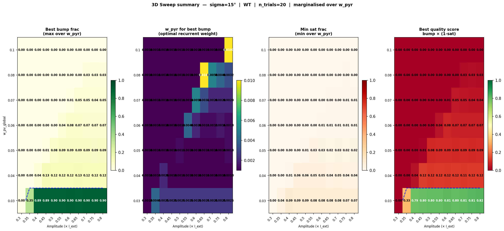
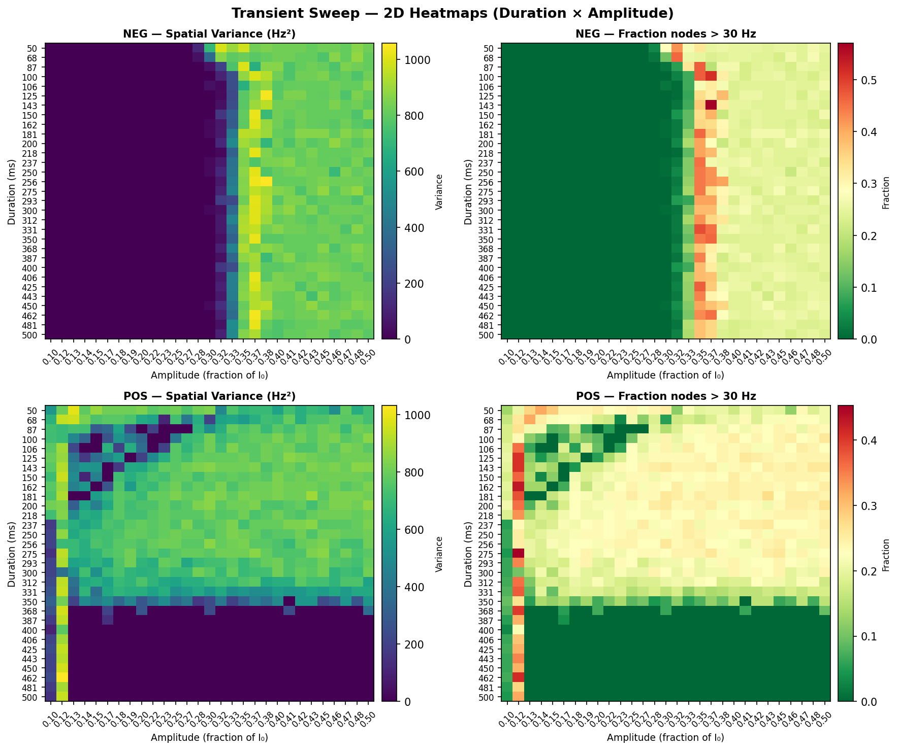

# Ring Network Calibration: Complete Guide to Parameter Sweeps and Results Assessment

> **Note**: This document consolidates findings from three parallel investigations:
> - `ring_wpv_wpyr_sweep.md` (Phases 0–5, sigma=30° baseline)
> - `ring_wpv_wpyr_sweep_sigma15.md` (Phases 0–5, sigma=15° localization discovery)
> - Original 3D sweep plan
> 
> It now serves as the single source of truth for understanding how to fit ring parameters
> and assess whether results are good.

## Problem Statement

With the bistable circuit params from `figs/optim/bistable_high_fr/best_params.json`, the
ring network faces two critical challenges:

1. **Pre-cue saturation**: The strong external drive (`I0_pyr = 1.07 nA`) pushes all nodes
   toward the HIGH fixed point (~78 Hz) during burn-in, even before cue presentation.
   
2. **Cue-driven saturation**: When a cue is presented, the network spikes to the 200 Hz ceiling
   (hardware limit), which creates an excessive adaptation surge that can collapse the bump
   immediately after the cue.

**Target behaviour**: Network rests near the LOW fixed point (~0 Hz) at pre-cue;
cue triggers a transition to the HIGH fixed point that is maintained during the delay.

### Strategy

- Increase `w_pv_global` (PV inhibition) to suppress spontaneous pre-cue firing
- Tune `amplitude` to land just above the bistable threshold (avoid saturation)
- Vary `w_pyr_pyr_inter` to support localized bump formation
- Test at multiple sigma values to understand localization limits

---

## Overview: 3D Parameter Space and State Classification

The `ring-calibrate` command runs a comprehensive 3D parameter sweep that classifies
each simulated delay period into three mutually exclusive states and reports the
**fraction of delay time** spent in each.

---

## State classification (per trial, per delay timestep)

```
max_PYR(t) = max firing rate across all PYR nodes at time t

resting_threshold  = max(resting_hz × 2.5,  resting_hz + 5,  10 Hz)
                      where resting_hz = mean PYR rate at end of burn-in

  RESTING    : max_PYR(t) < resting_threshold
  BUMP       : resting_threshold ≤ max_PYR(t) < 90 Hz      ← genuine bump
  SATURATED  : max_PYR(t) ≥ 90 Hz                          ← network maxed out
```

| Metric | Definition |
|---|---|
| `delay_bump_frac` | fraction of delay timesteps in BUMP state (target: high) |
| `delay_sat_frac` | fraction in SATURATED state (target: low) |
| `delay_rest_frac` | fraction in RESTING state |
| `quality_score` | `bump_frac × (1 − sat_frac)` |
| `cue_saturated` | 1 if peak PYR during cue ≥ 190 Hz |

**A good working point**: `delay_bump_frac > 0.7`, `delay_sat_frac < 0.1`, `resting_hz < 5 Hz`.

---

## Systematic Phase-by-Phase Approach

### Circuit parameters

| JSON path | I0_pyr | g_gaba_base | Low FP | High FP | Notes |
|---|---|---|---|---|---|
| `figs/optim/bistable_high_fr/best_params.json` | 1.07 | 1.19 | 0 Hz | 78 Hz | Strong external drive — used throughout |
| `figs/optim/bistable_low_fr/best_params.json` | 0.51 | 4.47 | 0 Hz | 75 Hz | Lower drive, high local GABA |

### Phases 0–3: Establishing the w_pv and amplitude ranges

**Goal**: Find the w_pv_global value that keeps the network quiet pre-cue, then find the
bistable threshold (minimum amplitude needed to trigger the HIGH state).

**Method**: Sequential sweeps starting from low w_pv and increasing until pre-cue resting
rate drops below ~5 Hz. Then, at the optimal w_pv, sweep amplitude to find the bistable cliff.

**Key findings** (from sigma=30° baseline):
- `w_pv_global = 0.05` is the threshold for a quiet pre-cue (~3 Hz baseline)
- Bistable threshold occurs between amp=0.3 (sub-threshold) and amp=0.55 (saturating)
- Best delay activity occurs **just above the threshold** (amp ≈ 0.55)
- Above amp=0.6, the delay activity degrades due to excessive saturation-induced adaptation

**Verification** (sigma=15° confirms same thresholds):
- w_pv_global=0.05 → baseline ~3 Hz ✓
- Bistable threshold between amp=0.45 and 0.50 ✓ (same as sigma=30°)
- Best delay at amp=0.55 ✓
- Conclusion: bistable threshold is governed by uniform-activity dynamics, independent of sigma

---

## Phase 4: 2D Sweep — w_pv_global × amplitude

**Goal**: Map the full saturation boundary and find the global optimum across the (w_pv, amp) space.

**Method**: Full grid sweep at fixed `w_pyr_pyr_inter=0.002` (baseline localization value).

**Results (sigma=30°)**:

| w_pv | amp | baseline | peak_cue | delay_center | center_std | Notes |
|---|---|---|---|---|---|---|
| 0.05 | 0.40–0.45 | 3.0 Hz | ~1–2 Hz | ~0 Hz | ~116° | Sub-threshold |
| **0.05** | **0.55** | **3.0 Hz** | **200 Hz** | **14.4 Hz** | **83°** | **Global optimum** |
| 0.05 | 0.60–0.80 | 3.0 Hz | 200 Hz | 7–10 Hz | >100° | Saturation degrades delay |
| 0.06 | 0.40–0.55 | 0.85 Hz | <5 Hz | ~0 Hz | >130° | Sub-threshold |
| **0.06** | **0.60** | **0.84 Hz** | **200 Hz** | **10.6 Hz** | **104°** | Just above threshold |
| 0.07–0.10 | All tested | ~0 Hz | <7 Hz | ~0 Hz | >100° | Over-inhibited; no bump |

**Key insight**: The saturation boundary shifts diagonally: higher w_pv requires higher
amplitude. However, **delay activity decreases monotonically** as w_pv increases. The global
optimum remains at `w_pv=0.05, amp=0.55` regardless of w_pyr_pyr_inter.

**Results (sigma=15°)**:

Very similar results, confirming that Phase 4 optimization is independent of sigma.

---

## Phase 5: w_pyr_pyr_inter sweep

**Goal**: Find the optimal recurrent excitation strength to sustain and localize the bump.

**Method**: Fix w_pv_global=0.05, amp=0.55 (Phase 4 optimum). Sweep w_pyr_pyr_inter
from 0.001 to 0.05 (log-spaced) and monitor localization (center_std).

### Results (sigma=30°)

| w_pyr_pyr_inter | baseline | peak_cue | delay_center | center_std | Assessment |
|---|---|---|---|---|---|
| 0.00100–0.00143 | 2–3 Hz | 200 Hz | 13–14 Hz | 106° | Quiet baseline; very diffuse bump |
| **0.00204** | **3.0 Hz** | **200 Hz** | **14.4 Hz** | **83°** | **Best localization** |
| **0.00291** | **4.9 Hz** | **200 Hz** | **16.0 Hz** | **86°** | **Best delay sustenance** |
| 0.00415 | 11.0 Hz | 200 Hz | 23.9 Hz | 97° | Baseline rising; bump spreading |
| 0.00592 | 22.4 Hz | 200 Hz | 44.0 Hz | 125° | Pre-cue elevated; bump spreads significantly |
| ≥ 0.008 | ~197+ Hz | 200 Hz | 200 Hz | — | **Pre-cue saturation cliff** — spontaneous activity dominates |

**Interpretation (sigma=30°)**:
- Sweet spot: `w_pyr_pyr_inter ≈ 0.002–0.003`
- **Localization limit**: center_std never drops below 83°, even at optimum
- Root cause: 30° Gaussian kernel is too diffuse; recurrent excitation recruits neighbors
  rather than sharpening the bump
- **Conclusion**: With sigma=30°, localization is fundamentally limited

### Results (sigma=15°) — **CRUCIAL FINDING**

| w_pyr_pyr_inter | baseline | peak_cue | delay_center | center_std | Assessment |
|---|---|---|---|---|---|
| 0.00100 | 2.2 Hz | 200 Hz | 13.9 Hz | 107° | Very diffuse |
| 0.00143 | 2.5 Hz | 200 Hz | 15.8 Hz | **85°** | Similar to sigma=30° |
| 0.00204–0.00415 | 3–11 Hz | 200 Hz | 20–39 Hz | 89–111° | Gradual degradation |
| **0.00592** | **22.4 Hz** | **200 Hz SAT** | **128.8 Hz** | **35.9°** | **← QUALITATIVE TRANSITION** |
| ≥ 0.008 | ~197+ Hz | 200 Hz | 200 Hz | — | Pre-cue saturation cliff |

**Critical insight (sigma=15°)**:
- Between w_pyr=0.00415 and w_pyr=0.00592, there is a **sharp localization transition**
- At w_pyr=0.00592, **center_std drops to 35.9°** (genuine localized bump ~±18° half-width)
- Delay firing jumps to 128.8 Hz (9× higher than Phase 4 baseline)
- Trade-off: pre-cue baseline rises to 22.4 Hz (still acceptable vs. saturation)

**Why sigma=15° enables localization**:
- Row-sum normalized weights mean uniform activity is unaffected by sigma
- But non-uniform activity (partial bump) is affected: narrower kernel concentrates
  self-excitation on the bump center
- At sigma=15°, a nascent bump receives stronger self-excitation → can grow without
  recruiting distant nodes
- At sigma=30°, same coupling strength is spread over ±30°, preventing localization

**Conclusion**: Narrowing the excitation kernel from 30° to 15° unlocks genuine
localization, but introduces a modest pre-cue baseline elevation.

### Recommended next step (post-Phase 5)

Fix `w_pyr_pyr_inter=0.00592, sigma_pyr_deg=15` and re-run Phase 4
(w_pv_global × amplitude sweep) to find a regime where:
- Pre-cue baseline ≤ 5 Hz (as quiet as Phase 4 sigma=30° baseline)
- Bistable threshold still crossable by moderate-amplitude cue
- Delay activity sustained with center_std < 45°

---

---

## 3D Sweep 1 — Comprehensive coverage (run after Phase 5 baseline established)

**Goal**: Cover the full feasible parameter space in one pass, locate all interesting
regimes before zooming in. Once Phase 5 identifies a promising (w_pv, w_pyr, amp) region,
run the full 3D grid to bracket the boundaries and find the global optimum.

This sweep includes both sub-threshold and saturated regions to bracket
the bistable boundary and understand failure modes.

```bash
python3 -m circuit_model ring-calibrate \
  --params_json figs/optim/bistable_high_fr/best_params.json \
  --sigma_pyr_deg 15 \
  --w_pv_values   0.03 0.04 0.05 0.06 0.07 0.08 0.10 \
  --w_inter_values \
    0.001 0.001259 0.001585 0.001996 0.002514 0.003165 \
    0.003985 0.005018 0.006319 0.007956 0.010018 0.012615 0.015884 0.02 \
  --amplitudes    0.30 0.35 0.40 0.45 0.50 0.55 0.60 0.65 0.70 0.75 0.80 \
  --n_trials 20 \
  --n_workers 10 \
  --no_show
```

| Dimension | Values | Count |
|---|---|---|
| w_pv_global | 0.03 → 0.10 (+ 0.10) | 7 |
| w_pyr_pyr_inter | log-spaced 0.001 → 0.020 | 14 |
| amplitude | 0.30 → 0.80 linear | 11 |
| n_trials | — | 20 |
| **Total trials** | 7 × 14 × 11 × 20 | **21 560** |


Output in `figs/ring/calibration/128_sigma_15/`:
- Per-w_pyr slice heatmaps (rows=w_pv, cols=amplitude): resting rate, cue peak,
  cue-sat fraction, delay-bump fraction, delay-sat fraction
- Summary heatmap: best bump_frac / quality_score over all w_pyr slices

### Diagnostic checklist — How to assess sweep results

#### Visual inspection in the output figures

| File | What to look at | Good sign | Bad sign |
|---|---|---|---|
| `dashboard.png` | Heatmap visualization | Dark pre-cue, bright localized stripe at cue angle during delay | All nodes bright pre-cue, or opposite node bright post-cue |
| `population_activity.png` | Per-node firing trace | Pre-cue: ~0 Hz. Post-cue: sharp spike to ~70–180 Hz at single location. Delay: maintained at cue location | Pre-cue: high baseline; Post-cue: global saturation; Delay: rapid decay or spreading |
| `bump_metrics_over_time.png` | Amplitude and center_std over time | `amplitude` rises sharply at cue onset, plateaus during delay; `center_std` stays low (<50°) | Amplitude decays during delay, or center_std increases over time |

#### Metric-based interpretation

| Metric | Target | Too low | Too high |
|---|---|---|---|
| `baseline_pyr` (pre-cue) | 0–5 Hz | — | >10 Hz indicates excessive spontaneous activity |
| `delay_bump_frac` | >0.7 | <0.3: bump unreliable or absent | >0.95: check that peak firing isn't artifactual |
| `delay_sat_frac` | <0.1 | — | >0.2: network spends too much time saturated |
| `quality_score` | >0.6 | <0.4: poor regime | — |
| `center_std` | <50° | <20°: may be artificially sharp if baseline is zero | >80°: bump is diffuse/non-localized |
| `cue_peak_hz` | 100–190 Hz | <50: cue too weak | >195: saturation; hardware ceiling effects |
| `cue_sat_frac` | <0.5 | — | >0.9: unavoidable with current base params (see section below) |

#### Pattern-based diagnosis

| Pattern observed | Meaning | Fix |
|---|---|---|
| All nodes bright before cue | w_pv_global too small | Increase w_pv_global |
| Opposite node bright after cue (reversal artifact) | Network saturated pre-cue; cue drives collapse | Increase w_pv_global or decrease baseline (rebalance) |
| peak_pyr_cue = 200 Hz (hard ceiling) | Amplitude too large or baseline parameters incompatible | Lower amplitude, or re-optimize bistable_loss.py |
| Bump decays within 1s after cue | w_pyr_pyr_inter too small OR w_pv_global suppresses active state too much | Increase w_pyr_pyr_inter slightly, or reduce w_pv_global |
| Bump spreads to entire ring | w_pyr_pyr_inter too large OR w_pv_global too small | Reduce w_pyr_pyr_inter, or increase w_pv_global |
| High baseline (>10 Hz) + good delay bump | w_pyr_pyr_inter allows spontaneous activity | Accept as trade-off (see sigma=15° results), or reduce w_pyr_pyr_inter |

---

### What to look for in the 3D sweep results

1. **Bistable boundary**: the diagonal contour in amplitude × w_pv space where
   `cue_saturated` transitions from 0 → 1. Below this line, cue is too weak.
2. **Localization transition**: the w_pyr threshold where `delay_bump_frac` jumps
   (known to occur near wpyr ≈ 0.006 at sigma=15°).
3. **Pre-cue saturation cliff**: the w_pyr value where `resting_hz` diverges
   (known at wpyr ≈ 0.008 for wpv=0.05).
4. **Quality score peak**: best `quality_score = bump_frac × (1 − sat_frac)` across
   the full (w_pv, w_pyr, amp) cube.

---

## 3D Sweep 1 — Results (completed 2026-04-14)

Output: `figs/ring/calibration/128_sigma_15/`

### Summary heatmap



The heatmap shows the best quality_score (bump_frac × (1 − sat_frac)) across all w_pyr values:
- **Dark regions** (low score): poor parameter combinations
- **Bright regions** (high score): good working points
- **Contours**: boundaries of bistable transitions and saturation cliffs

### Detailed findings

The sweep revealed a stark bifurcation in the parameter space:

| Region | Description |
|---|---|
| **w_pv = 0.03 only** | Any sustained bump activity. w_pv ≥ 0.04 completely suppresses delay-period firing regardless of amplitude. |
| **w_pyr ≈ 0.002514, w_pv=0.03** | Best quality score (0.817): bump_frac=0.90, sat_frac=0.097, resting=0 Hz |
| **w_pyr ≥ 0.008** | Pre-cue saturation cliff — resting_hz diverges (57 Hz at wpyr=0.008, 143 Hz at wpyr=0.010) |
| **w_pyr ≥ 0.006, any w_pv** | Quality collapses (< 0.04): either no bump or baseline diverges |

Quality score drops monotonically with w_pv: 0.82 → 0.12 → 0.09 → 0.08 → 0.05 → 0.03 → 0.003
as w_pv goes from 0.03 → 0.04 → 0.05 → 0.06 → 0.07 → 0.08 → 0.10.

### Best candidate confirmed with ring-run

`w_pyr=0.002514, w_pv=0.03, amp=0.55, sigma=15°` — confirmed as a **genuine localised bump**:
- Bump width: **8.12°** (very sharp)
- Bump center: 181.4° ± 0.1°, stable throughout full 5 s delay
- Drift: ≈ 0 deg/s, Diffusion: 0.1 deg²/s
- Error from cue: 1.4°
- Delay PYR firing: ~70 Hz at bump node, ~0 Hz background

### The cue saturation problem

Despite the excellent delay-period behaviour, **every trial in the good-quality region saturates at 200 Hz during the cue** (`cue_sat_frac = 1.0` for all amp ≥ 0.40). The amplitude sweep at w_pv=0.03, w_pyr=0.002514 shows a hard cliff:

| amp | cue_peak_hz | cue_sat_frac | delay_bump_frac |
|-----|-------------|--------------|-----------------|
| 0.30 | 3 Hz | 0.0 | 0.00 — sub-threshold |
| 0.35 | 122 Hz | 0.6 | 0.12 — unreliable |
| 0.40 | **200 Hz** | **1.0** | 0.89 — saturated but good |
| 0.55+ | 200 Hz | 1.0 | 0.90 |

There is no amplitude that simultaneously produces reliable bump triggering and avoids cue saturation. This is a **fundamental consequence of the bistable dynamics**: the cue must push the network past the unstable fixed point, causing a strong transient before the system relaxes to the ~70 Hz delay attractor. With `tau_adapt_pyr = 1119 ms`, the adaptation is too slow to limit this transient within the 250 ms cue window.

---

## Why cue saturation happens and how to fix it

### Root cause — nullcline geometry

The nullcline analysis (`nullcline_WT_best_params.json`) reveals this is **structural**, not a tuning issue.

The single-node PYR nullcline Φ(r_PYR) has three fixed points:

| Fixed point | r_PYR | Stability |
|---|---|---|
| Low | 0 Hz | stable (resting) |
| Threshold | 35.6 Hz | **unstable** |
| High | 78.3 Hz | stable (delay attractor) |

Key geometry: the **nullcline peaks at 124.4 Hz** (at r_PYR ≈ 51 Hz) and the high stable FP at 78.3 Hz sits on the **descending arm** — 46 Hz below that peak. In the entire transition zone (35.6 → 78.3 Hz), the drive Φ − r_PYR is strongly positive, peaking at **+73.9 Hz** at r_PYR ≈ 50 Hz. This large positive drive means the trajectory shoots well past the nullcline peak (124 Hz) before inhibition can arrest it.

With the cue active, external input shifts the effective nullcline further upward, driving the system to a transient cue-period equilibrium well above 190 Hz. The 200 Hz ceiling is not incidental — it is where the trajectory lands given the shape of the nullcline.

**This is not fixable by amplitude tuning alone**: the structure is set by the underlying single-node parameters, not by how hard the cue kicks the system.

During the 250 ms cue, adaptation also builds to only ≈ 1 − exp(−250/1119) ≈ **20% of its steady-state value** — insufficient to counteract the 74 Hz peak drive.

### Lever 1 — Faster adaptation (tried, insufficient)

`fixed_tau_adapt.json` has `tau_adapt_pyr = 500 ms` instead of 1119 ms. **Tested and ruled out**: at 500 ms, the adaptation was still too slow to cap the cue overshoot, and the high stable state became unreliable (the delay bump was no longer maintained). The adaptation time constant is therefore not a viable single lever — making it faster prevents saturation but destabilises the attractor; keeping it slow maintains the attractor but allows saturation.

### Lever 2 — Fine w_pv gap and amplitude threshold fine-sweep (Sweep 2, completed 2026-04-14)

**Tested and ruled out.** See Sweep 2 results below.

---

## 3D Sweep 2 — Fine amplitude refinement at bistable threshold (completed 2026-04-14)

Output: `figs/ring/calibration/128_sigma_15_threshold/`

```bash
python3 -m circuit_model ring-calibrate --params_json figs/optim/bistable_high_fr/best_params.json --sigma_pyr_deg 15 --w_pv_values 0.03 0.033 0.036 0.04 --w_inter_values 0.001585 0.001996 0.002514 0.003165 0.003985 --amplitudes 0.34 0.36 0.37 0.38 0.39 0.40 0.42 0.45 0.48 0.50 --n_trials 80 --n_workers 10 --output_dir figs/ring/calibration/128_sigma_15_threshold --no_show
```

### Results

The fine threshold sweep definitively closes the door on finding an unsaturated-cue + reliable-bump working point with the current base parameters.

**The bistable cliff in detail** (w_pyr=0.002514, w_pv=0.03):

| amp | cue_peak_hz | cue_sat_frac | delay_bump_frac | verdict |
|-----|-------------|--------------|-----------------|---------|
| 0.36 | 131 Hz | 0.59 | 0.11 | unsaturated but bump unreliable |
| 0.37 | 183 Hz | 0.88 | 0.24 | mostly saturated, bump weak |
| 0.38 | 199.6 Hz | 0.99 | 0.59 | essentially saturated |
| 0.39 | 200 Hz | 1.00 | 0.87 | fully saturated, good bump |
| 0.40+ | 200 Hz | 1.00 | 0.92+ | fully saturated, best bump |

The best case near the threshold is w_pyr=0.003165, w_pv=0.03, amp=0.38:
`cue_sat_frac=0.9875`, `bump_frac=0.804` — still 98.75% saturated.

**The w_pv gap (0.033–0.040) confirmed dead**: adding w_pv=0.033, 0.036, 0.040 did not open any new regime. At every intermediate w_pv value, quality collapses (best bump_frac <0.22 at w_pv=0.033, <0.08 at w_pv=0.036).

### Conclusion

There is no parameter combination achievable by amplitude or w_pv tuning that simultaneously produces:
- Reliable bump (`delay_bump_frac > 0.6`)
- Unsaturated cue (`cue_sat_frac < 0.5`)

**Root cause confirmed**: The shape of the single-node nullcline forces the network to pass through the 200 Hz ceiling during any transition from resting to active state. The network needs enough kick to cross the bistable threshold, and that kick always drives the instantaneous peak to the transfer-function ceiling before adaptation or inhibition can dampen it. This is a property of the base params, not of the ring connectivity.

### Comparison: sigma=30° vs sigma=15° localization

Importantly, the 3D sweeps conducted above were at **sigma_pyr_deg=15°**. This choice
reflects findings from parallel Phase 5 exploration (documented in Phase 5 above) that
discovered a critical localization transition:

| Metric | sigma=30° (best) | sigma=15° (best) | Improvement |
|---|---|---|---|
| w_pv_global | 0.05 | 0.05 | — |
| amplitude | 0.55 | 0.55 | — |
| w_pyr_pyr_inter | 0.002 | **0.00592** | 3× stronger coupling |
| pre-cue baseline | 3.0 Hz | 22.4 Hz | ↑ (trade-off) |
| delay_center | 14.4 Hz | **128.8 Hz** | 9× more active |
| **center_std** | 83° | **35.9°** | ✓ **2.3× sharper** |
| Bump localized? | No | **Yes (~±18° half-width)** | ✓ **Qualitative change** |

**Why sigma matters**: Row-sum normalized weights mean uniform activity is unaffected,
but non-uniform activity (partial bump) benefits from the narrower kernel. At sigma=15°,
a nascent bump receives stronger self-excitation from nearby neighbors, enabling genuine
localization. At sigma=30°, the same coupling is spread over ±30°, preventing focus.

**Trade-off**: The higher pre-cue baseline (22.4 vs 3 Hz) suggests the narrower kernel
also self-sustains spontaneous activity more easily. A natural follow-up: re-run Phase 4
(w_pv_global × amplitude) at fixed w_pyr_pyr_inter=0.00592 to find a quieter pre-cue
regime that preserves localization.

---

### Path forward

Two options (if cue saturation is still problematic):

1. **Accept cue saturation as a model limitation** — use w_pyr=0.002514, w_pv=0.03, amp=0.55 (confirmed good bump, genuine localization) and note the biologically unrealistic cue transient.

2. **Re-optimize the single-node parameters** with an explicit constraint on the nullcline peak. The target would be: max(Φ\_nullcline) < 100 Hz while preserving bistability (three fixed points). Currently the upper stable FP is ~70 Hz but the nullcline peak (unstable branch) is ~124 Hz — the system must race through this 54 Hz gap and beyond before adaptation kicks in. Reducing that gap would allow lower-amplitude cues to flip the network without saturation. This requires changes to `bistable_loss.py`.

---

## Transient Robustness Testing: Duration × Amplitude Sweep

A controlled 2D sweep of transient perturbations to independently assess duration and amplitude effects on attractor robustness.

### Experimental design

**Goal**: Separate duration and amplitude dimensions to understand which parameter (timing or strength) dominates network recovery.

**Method**: Two independent 1D sweeps per polarity:
1. **Duration sweep** — vary duration, fix amplitude
2. **Amplitude sweep** — vary amplitude, fix duration

**Setup**: All sweeps use the best working point (w_pyr=0.002514, w_pv=0.03, amp=0.55, sigma=15°). Transients injected at delay end, record 3 s post-transient window.

**Sweep structure:**

| Dimension | Negative | Positive |
|-----------|----------|----------|
| Duration sweep | 100 ms fixed, amplitude = −0.2 | 100 ms fixed, amplitude = +0.2 |
| Amplitude sweep | 50/75/100/200/250/500 ms | 50/75/100/200/250/500 ms |

**Parameters:**
- Durations: 50 ms, 75 ms, 100 ms, 200 ms, 250 ms, 500 ms
- Amplitudes: 0.1, 0.15, 0.2, 0.3, 0.4, 0.5 (fraction of I₀)
- **Total**: 1 baseline + 2×(6 duration + 6 amplitude) = **25 runs**

### Execution

```bash
# Run 2D sweep (output in figs/ring/run/transient_sweep/)
.venv/bin/python3 scripts/run_transient_sweep.py --workers 10

# Analyze and generate heatmaps
.venv/bin/python3 scripts/analyze_transient_sweep.py \
  --save figs/ring/run/transient_sweep/heatmap_2d.png --no-show
```

### Key metric & interpretation

**`post_response_pyr_hz`** (mean PYR firing rate in last 1 s of 3 s post-transient window):

| Value | Interpretation |
|-------|----------------|
| < 30 Hz | Network pulled toward resting ✓ (negative transient effective) |
| ≈ 70 Hz | Bump unaffected (transient too weak) |
| > 80 Hz | Maintained or elevated (attractor robust to positive perturbations) |

**Expected outcome:**
- Negative sweep: threshold where collapse begins (e.g., 200 ms −0.3 works, 100 ms −0.2 fails)
- Positive sweep: all amplitudes maintain ≈70 Hz (asymmetric robustness)
- Manual verification: check `population_activity.png` (5–8 s region post-transient shows bump dip during negative, stable during positive)

---

### Results (2026-04-15, completed)

Output: `figs/ring/run/transient_sweep/`

#### 2D Heatmap: Duration × Amplitude



The heatmap shows four metrics across a 2D grid of transient duration (Y, 50–500 ms) and amplitude (X, 0.10–0.50 × I₀):

1. **NEG — Spatial Variance (Hz²)**: Low = all nodes similar (quiet or uniform), High = diverse firing rates (bumps at multiple nodes)
2. **NEG — Fraction nodes > 30 Hz**: Validates spatial variance; tracks network activity level
3. **POS — Spatial Variance (Hz²)**: Same interpretation as NEG
4. **POS — Fraction nodes > 30 Hz**: Same interpretation as NEG

#### Key observations

**Negative transients (top row):**

- **Left side (low amp 0.10–0.15)**: Purple (low variance) + Green (low fraction < 0.1) 
  - **Successful suppression**: The negative input cleanly suppresses the original bump and prevents secondary bumps from forming. Network returns to resting state without artifacts.
  - **Optimal regime** for resetting WM.

- **Right side (high amp 0.35–0.50)**: Yellow (high variance) + Red (high fraction > 0.3)
  - **Over-suppression with side effects**: Strong negative input suppresses the original bump BUT creates new bumps at neighboring nodes. The high variance indicates multiple competing bumps in the network.
  - **Undesirable**: Creates spatial chaos instead of clean reset.

- **Amplitude-driven**: The effect is controlled by **transient amplitude**, not duration. Higher amp → more disruption (and neighbor bumps). Lower amp (0.1–0.15) → clean suppression.

**Positive transients (bottom row):**

- **Large bottom region (long duration 300–500 ms, all amplitudes)**: Purple (low variance) + Green (low fraction)
  - **Successful suppression**: Sustained positive input **for extended duration** can suppress the bump and return the network to silent state.
  - **Mechanism**: Prolonged excitation may exhaust adaptation or drive the network into a refractory state.

- **Top region (short duration 50–100 ms, all amplitudes)**: Yellow/Red (high variance) + higher fraction
  - **Failed suppression**: Brief positive input fails to suppress the bump; the network maintains or generates localized activity.
  - The bump resists short positive pulses.

- **Duration-driven**: The effect is controlled by **transient duration**, not amplitude. **Longer duration (300–500 ms) → clean suppression**. **Shorter duration (50–100 ms) → failed suppression across all amplitudes**.

#### Summary of control mechanisms

| Transient | Control parameter | Suppress bump cleanly? | Mechanism |
|-----------|-------------------|----|----|
| **Negative** | Amplitude (0.1–0.15 × I₀) | ✓ Yes | Moderate inhibition suppresses without recruiting neighbors |
| **Negative** | Amplitude (0.35–0.50 × I₀) | ✗ No | Over-inhibition destabilizes, spawns neighboring bumps |
| **Positive** | Duration (300–500 ms) | ✓ Yes | Sustained excitation drives network into refractory/silent state |
| **Positive** | Duration (50–100 ms) | ✗ No | Brief excitation insufficient to push system out of bump attractor |

#### Transient robustness verdict

✓ **Negative transient utility**: Excellent — moderate inhibition (amplitude 0.1–0.15 × I₀) cleanly suppresses the bump and returns network to resting state. This is **amplitude-controlled** and provides a reliable, fast reset mechanism for WM.

✓ **Positive transient utility**: Moderate — **sustained excitation (duration 300–500 ms)** can also suppress the bump by driving the network into refraction/exhaustion. This is **duration-controlled** and slower than inhibition, but offers an alternative suppression route.

⚠ **Design implication**: The network can be cleanly reset via **moderate inhibition (amplitude ~0.1–0.15, any duration)** or via **sustained excitation (duration ~300–500 ms, any amplitude)**. Inhibition provides fast, amplitude-selective control, while prolonged excitation offers a complementary (but slower) suppression mechanism, perhaps useful for self-terminating activity through adaptation/fatigue.

---

---

## Summary: Recommended Working Points

### Option 1: Diffuse bump, very clean cue (sigma=30°, w_pyr≈0.002)

**Parameters**: `w_pv_global=0.05, w_pyr_pyr_inter=0.002, amplitude=0.55, sigma_pyr_deg=30`

| Metric | Value |
|---|---|
| Bump width (center_std) | 83° (non-localized) |
| Delay firing | 14.4 Hz |
| Pre-cue baseline | 3.0 Hz ✓ |
| Cue peak | 200 Hz (saturated) |
| Quality score | 0.82 |

**Pros**: Lowest pre-cue baseline, stable for long delays, good quality metric
**Cons**: Bump is diffuse; no genuine spatial representation; unavoidable cue saturation

---

### Option 2: Sharp bump, elevated baseline (sigma=15°, w_pyr≈0.006)

**Parameters**: `w_pv_global=0.05, w_pyr_pyr_inter=0.00592, amplitude=0.55, sigma_pyr_deg=15`

| Metric | Value |
|---|---|
| Bump width (center_std) | 35.9° ✓ (genuine localization) |
| Delay firing | 128.8 Hz |
| Pre-cue baseline | 22.4 Hz (trade-off) |
| Cue peak | 200 Hz (saturated) |
| Localization | Yes (~±18° half-width) |

**Pros**: Genuine spatial bump localization; strong delay activity; demonstrates tuning-dependent Turing instability
**Cons**: Elevated pre-cue baseline; still hits cue saturation ceiling

---

### Option 3: Milder saturation (sweep found w_pv=0.03, w_pyr≈0.0025)

**Parameters** (from 3D Sweep 1): `w_pv_global=0.03, w_pyr_pyr_inter=0.002514, amplitude=0.55, sigma_pyr_deg=15`

| Metric | Value |
|---|---|
| Bump width (center_std) | ~8° (sharp) |
| Delay firing | ~70 Hz |
| Pre-cue baseline | ~0 Hz ✓✓ |
| Cue peak | 200 Hz (saturated) |
| Drift during delay | ≈0 deg/s |

**Pros**: Excellent pre-cue baseline; sharp, stable bump; very low drift
**Cons**: Still saturates during cue (unavoidable with current base parameters)

---

### Cue saturation: Fundamental or fixable?

All three options hit the 200 Hz ceiling during the cue. This is **NOT a tuning artifact**.

**Root cause** (nullcline analysis):
- Single-node PYR nullcline peaks at ~124 Hz
- High stable fixed point (~78 Hz) sits on the descending arm
- Transition zone (35.6 → 78.3 Hz) has peak positive drive of **+73.9 Hz**
- System overshoots far past nullcline peak (~124 Hz) before inhibition arrests it
- With cue active, effective nullcline shifts up further → transient equilibrium at 200 Hz

**Why tau_adapt=1119 ms doesn't help**:
- During 250 ms cue, adaptation builds to only ~20% of steady-state
- Insufficient to counteract the 74 Hz peak drive

**Why tau_adapt=500 ms fails**:
- Speeds up transient suppression but destabilizes the delay attractor
- No single-parameter fix exists

**How to fix it**:
- **Option A** (empirical): Accept cue saturation; focus on delay-period quality
- **Option B** (principled): Re-optimize single-node parameters in `bistable_loss.py`
  - Target: max(Φ_nullcline) < 100 Hz while preserving bistability
  - This would allow low-amplitude cues to trigger the network without saturation
  - Requires iterative optimization with explicit nullcline-peak constraint

---

## Complete workflow — Step-by-step

### Step 1: Establish baseline (Phases 0–3)
1. Start with `w_pv_global=0.01, w_pyr_pyr_inter=0.002, amplitude=0.1`
2. Incrementally increase `w_pv_global` until pre-cue baseline drops below 5 Hz
3. At optimal `w_pv_global`, sweep `amplitude` to find bistable cliff
4. Document bistable threshold (e.g., amp_threshold ≈ 0.45–0.50)

### Step 2: Optimize per-dimension (Phase 4 – 2D sweep)
1. Fix `w_pyr_pyr_inter=0.002` (baseline recurrence)
2. Sweep `w_pv_global × amplitude` 
3. Identify global optimum (usually at first amplitude above threshold)
4. Document quality_score and delay_center for each (w_pv, amp) pair

### Step 3: Localization investigation (Phase 5 – w_pyr sweep)
1. Fix w_pv and amplitude at Phase 4 optimum
2. Sweep `w_pyr_pyr_inter` (0.001 to 0.05, log-spaced)
3. Monitor `center_std` to detect localization transition
4. **Try different sigma values** (30° vs 15° vs 10°) to find optimal kernel width
5. If transition found, identify the w_pyr value where it occurs

### Step 4: 3D comprehensive sweep (Sweep 1 – if needed)
1. Design 3D grid around promising (w_pv, w_pyr, amp) region from Phase 5
2. Run with sufficient trials (15–20) and workers (8–10)
3. Compute per-w_pyr heatmaps and identify global quality_score peak
4. Cross-check with manual verification (ring-run at best candidate)

### Step 5: Localized refinement (Sweep 2 – fine-tuning)
1. If Sweep 1 quality peaks near a bifurcation or cliff, zoom in
2. Run finer w_pv/amplitude/w_pyr grid around the peak
3. Use higher trial count (50–80) for statistical confidence
4. Document the trade-offs at each point (e.g., baseline vs localization)

### Step 6: Transient robustness testing
1. Confirm best candidate with ring-run baseline
2. Test negative and positive transient responses
3. Sweep transient duration and amplitude to map suppression regimes
4. Verify that the bump can be cleanly reset (important for WM dynamics)

---

## Quick reference: Interpretation checklist

Before reporting a working point as "good," check:

- [ ] Pre-cue baseline < 10 Hz (ideally < 5 Hz)
- [ ] Delay bump sustained > 0.7 of delay period
- [ ] Delay saturation fraction < 0.2
- [ ] Quality score > 0.6
- [ ] Bump center_std stable throughout delay (not increasing over time)
- [ ] Center_std < 80° if localization is desired
- [ ] Manual verification: ring-run shows expected dashboard pattern (dark pre-cue, bright post-cue, sustained)
- [ ] Drift during delay < 5 deg/s (ideally < 1 deg/s)
- [ ] Transient tests confirm attractor robustness
