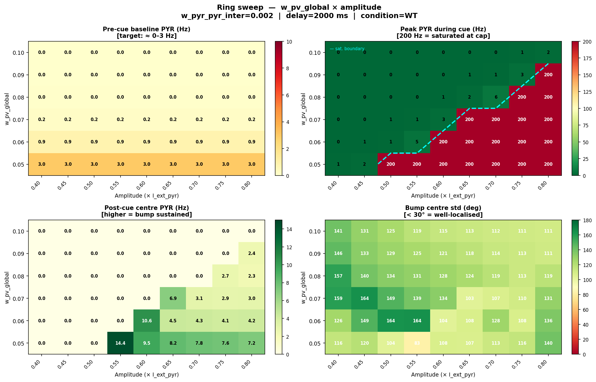
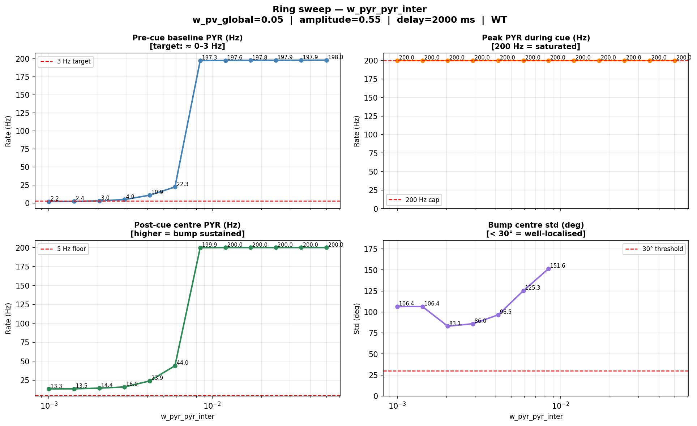
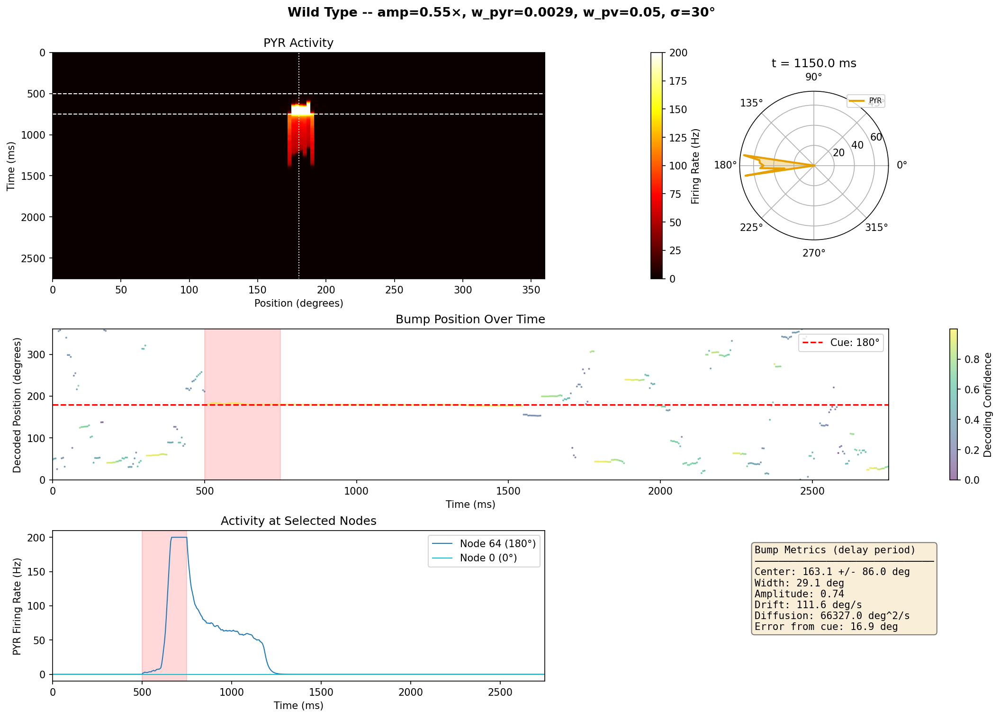

# Ring Network Parameter Sweep: w_pv_global × w_pyr_pyr_inter

## Problem Statement

With the bistable circuit params from `figs/optim/bistable_high_fr/best_params.json`, the
ring network collapses into its **HIGH fixed point (~78 Hz) during burn-in**, even before
cue presentation. Consequence: the cue presentation shifts the active node *to silence*
(adaptation-driven reversal) rather than recruiting it.

**Target behaviour**: network rests near the LOW fixed point (~0 Hz) at pre-cue;
cue triggers a transition to the HIGH fixed point that is maintained during the delay.

### Why the network saturates

- `I0_pyr = 1.07 nA` is a very strong external drive that pushes single nodes toward the
  ~78 Hz attractor.
- The LOW fixed point (0 Hz) is at the boundary: the sigma_noise = 0.1 can randomly kick
  any node past the unstable fixed point (~15 Hz), after which it races to 78 Hz.
- Inter-node PYR excitation then recruits neighbours, causing global saturation.

### Strategy

Increasing `w_pv_global` raises the total inhibitory pressure on PYR neurons across the
ring. When all nodes are uniformly active (burn-in), global PV inhibition scales with
N×r_PV and can suppress the spontaneous high state. Increasing `w_pyr_pyr_inter` supports
a *localised* bump post-cue.

The sweet spot: **w_pv_global large enough to keep burn-in in the low state**, and
**w_pyr_pyr_inter in a range that sustains a localized bump without spreading**.

> **Amplitude note**: `amplitude=N` means the cue adds `N × I_ext_pyr` = `N × 1.07 nA`
> on top of the baseline. Even `amplitude=1.0` injects +1.07 nA at the cue centre,
> saturating the network at the 200 Hz cap. The cue only needs to push nodes past the
> unstable FP (~15 Hz); very small amplitudes (0.05–0.5) should be sufficient in principle.

---

## Circuit parameters

| JSON path | I0_pyr | g_gaba_base | Low FP | High FP | Notes |
|---|---|---|---|---|---|
| `figs/optim/bistable_high_fr/best_params.json` | 1.07 | 1.19 | 0 Hz | 78 Hz | Strong external drive — used throughout |
| `figs/optim/bistable_low_fr/best_params.json` | 0.51 | 4.47 | 0 Hz | 75 Hz | Lower drive, high local GABA |

---

## Results — Phases 0–3: establishing the w_pv and amplitude ranges

All runs: `figs/optim/bistable_high_fr/best_params.json`, `w_pyr_pyr_inter=0.002`,
`delay_ms=3000`, `condition=WT`, `seed=442`.

**Phases 0–2** swept `w_pv_global` from 0.01 to 0.5 to find the pre-cue quiet regime.
**Phase 3** then swept amplitude from 0.05 to 1.0 at the best `w_pv_global=0.05` to find
the bistable threshold.

| w_pv_global | amp | baseline_pyr | peak_cue | delay_center | delay_opp | center_std | Assessment |
|---|---|---|---|---|---|---|---|
| 0.01 | 1.0 | **82 Hz** | 200 Hz | 2.4 Hz | **78 Hz** | 0.4° | Saturated pre-cue; reversal after cue |
| 0.02 | 2.0 | **74 Hz** | 200 Hz | 2.3 Hz | **75 Hz** | 0.3° | Still saturated; reversal |
| **0.05** | 2.0 | **3.0 Hz** | 200 Hz | 4.7 Hz | 0 | 96° | **Quiet pre-cue ✓** — but amp too high |
| 0.10 | 5.0 | 0.003 Hz | 200 Hz | 1.3 Hz | 0 | 109° | Over-inhibited; no bump |
| 0.20 | 10.0 | 0.002 Hz | 200 Hz | 1.2 Hz | 0 | 96° | Fully silenced |
| **0.05** | 0.05–0.3 | 3.0 Hz | ~0 Hz | ~0 Hz | 0 | ~115° | Below bistable threshold; cue has no effect |
| **0.05** | **0.55** | **3.0 Hz** | **200 Hz** | **14.4 Hz** | **0** | **83°** | **Threshold crossed; best delay activity** |
| **0.05** | 0.6–1.0 | 3.0 Hz | 200 Hz | 5–9 Hz | 0 | >100° | Saturates; residual activity decays |

**Key findings:**
- `w_pv_global = 0.05` is the threshold for a quiet pre-cue (~3 Hz baseline).
- There is a sharp bistable threshold between amp=0.3 (no effect) and amp=0.5 (full saturation).
- The best delay activity (14.4 Hz, lowest center_std=83°) occurs at **amp=0.55**, just above the threshold.
- Above amp=0.6, the delay activity degrades — higher saturation builds more adaptation current,
  which collapses the bump sooner after cue offset.
- The bump centre_std stays above 80° everywhere: `w_pyr_pyr_inter=0.002` cannot sustain the
  localised high state through recurrent excitation.

---

## Phase 4 — Full 2D sweep: w_pv_global × amplitude

**Motivation**: the saturation threshold shifts with `w_pv_global` (more inhibition → higher
amplitude needed to trigger the bistable jump). The idea is that a higher `w_pv_global`
combined with a proportionally higher amplitude might avoid the extreme 200 Hz saturation
and give the bump a better chance to settle after the cue, since the adaptation surge
(∝ peak_rate × cue_duration) would be smaller.

The sweep was run with `scripts/ring_wpv_amp_sweep.py` (`w_pyr_pyr_inter=0.002`,
`delay_ms=2000`, `--no_snapshot_mp4`):

```bash
python scripts/ring_wpv_amp_sweep.py --n_workers 6 --no_show
```



### Results — Phase 4

Full 54-point grid (`w_pv_global` 0.05→0.10, amplitude 0.40→0.80):

| w_pv | amp | baseline | peak_cue | delay_center | center_std | Notes |
|---|---|---|---|---|---|---|
| 0.05 | 0.40–0.45 | 3.0 Hz | ~1–2 Hz | ~0 Hz | ~116° | Sub-threshold |
| **0.05** | **0.55** | **3.0 Hz** | **200 Hz** | **14.4 Hz** | **83°** | **Best across full sweep** |
| 0.05 | 0.60–0.80 | 3.0 Hz | 200 Hz | 7–10 Hz | >100° | Saturation degrades delay |
| 0.06 | 0.40–0.55 | 0.85 Hz | <5 Hz | ~0 Hz | >130° | Sub-threshold |
| **0.06** | **0.60** | **0.85 Hz** | **200 Hz** | **10.6 Hz** | **104°** | Just above threshold |
| 0.06 | 0.65–0.80 | 0.85 Hz | 200 Hz | 4–5 Hz | >105° | Over-driven |
| 0.07 | 0.40–0.60 | 0.17 Hz | <3 Hz | ~0 Hz | >120° | Sub-threshold |
| **0.07** | **0.65** | **0.17 Hz** | **200 Hz** | **6.9 Hz** | **103°** | Just above threshold |
| 0.07 | 0.70–0.80 | 0.17 Hz | 200 Hz | 3 Hz | >107° | Over-driven |
| 0.08 | 0.40–0.70 | 0.04 Hz | <7 Hz | ~0 Hz | >119° | Sub-threshold |
| 0.08 | 0.75–0.80 | 0.04 Hz | 200 Hz | 2.3–2.7 Hz | >112° | Barely triggers; weak delay |
| 0.09 | 0.40–0.75 | 0.01 Hz | <4 Hz | ~0 Hz | >112° | Sub-threshold across range |
| 0.09 | 0.80 | 0.01 Hz | 200 Hz | 2.4 Hz | 112° | Barely triggers |
| 0.10 | 0.40–0.80 | ~0 Hz | <3 Hz | ~0 Hz | ~111° | Never reaches threshold in range |

**Interpretation:**
- The saturation boundary (amp where peak_cue jumps to 200 Hz) shifts diagonally: higher
  `w_pv_global` requires higher amplitude, but the delay activity at that boundary **decreases
  monotonically** as `w_pv_global` increases.
- `w_pv_global=0.05, amp=0.55` is the global optimum for delay sustenance.
- The saturation hypothesis is partially confirmed: the best delay activity always occurs at the
  **first amplitude above the threshold**, not at higher amplitudes. But the bump still doesn't
  localise (center_std > 80° everywhere) — the root bottleneck is `w_pyr_pyr_inter=0.002`.

---

## Phase 5 — w_pyr_pyr_inter sweep

**Motivation**: with the best inhibition/amplitude regime identified (`w_pv_global=0.05`,
`amp=0.55`), the remaining question is whether stronger inter-node recurrent excitation can
sustain the localised bump after cue offset. A dedicated sweep script mirrors Phase 4:

```bash
python scripts/ring_wpyr_sweep.py --w_pv_global 0.05 --amplitude 0.55 --n_workers 6 --no_show
```

Values to cover: `w_pyr_pyr_inter` from 0.001 to 0.05 (12 log-spaced points).



### Results — Phase 5

| w_pyr_pyr_inter | baseline | peak_cue | delay_center | center_std | Assessment |
|---|---|---|---|---|---|
| 0.00100 | 2.2 Hz | **200 Hz SAT** | 13.3 Hz | 106° | Quiet baseline; very diffuse bump |
| 0.00143 | 2.5 Hz | **200 Hz SAT** | 13.5 Hz | 106° | Same; no improvement |
| **0.00204** | **3.0 Hz** | **200 Hz SAT** | **14.4 Hz** | **83°** | **Best localization** (same as Phase 4 best) |
| **0.00291** | **4.9 Hz** | **200 Hz SAT** | **16.0 Hz** | **86°** | **Best delay sustenance** |
| 0.00415 | 11.0 Hz | 200 Hz SAT | 23.9 Hz | 97° | Baseline rising; spreading bump |
| 0.00592 | 22.4 Hz | 200 Hz SAT | 44.0 Hz | 125° | Pre-cue firing elevated; bump spreads |
| 0.00845 | **197 Hz** | 200 Hz SAT | **200 Hz** | 152° | **Network saturates before cue** |
| ≥ 0.012 | ~198 Hz | 200 Hz SAT | 200 Hz | — | Fully saturated; recurrent excitation too strong |

**Dashboard of the best delay-sustaining run** (`w_pyr_pyr_inter=0.00291`):



**Interpretation:**

- **Sweet spot**: `w_pyr_pyr_inter ≈ 0.002–0.003`. Below this, the delay activity is slightly
  weaker. Above 0.004, the baseline pre-cue firing starts rising sharply — the recurrent
  excitation allows spontaneous self-sustaining activity before the cue.
- **Cliff at ~0.008**: inter-node excitation is strong enough to bootstrap the network
  to the high state during burn-in, exactly like the pre-Phase 0 problem but now driven
  by recurrent PYR→PYR rather than I0_pyr.
- **Localization is not improved**: center_std stays above 80° across the entire range.
  Even at the optimum (0.002–0.003), the bump spans ≈ 83–86° — not the <30° target.
  Increasing `w_pyr_pyr_inter` makes the bump spread *more*, not less, because lateral
  excitation recruits neighbours rather than sharpening the active zone.
- **Root constraint**: with the current parameters (I0_pyr=1.07, sigma_pyr_deg=30°,
  adaptation τ=1119 ms), the Turing instability that would sharpen a bump appears to
  require a combination of wider inhibition and narrower excitation footprints, not simply
  stronger recurrent coupling.

**Conclusion from Phases 4+5**: the ring attractor sustains a bump most reliably at
`w_pv_global=0.05, amplitude=0.55, w_pyr_pyr_inter≈0.002–0.003`, but the bump remains
spatially diffuse. Further localization likely requires either a narrower excitation kernel
(`sigma_pyr_deg` < 30°) or a global-inhibition / Mexican-hat connectivity structure.

---

## Diagnostic checklist

| File | What to look at |
|---|---|
| `dashboard.png` | Heatmap: dark pre-cue, bright localised stripe at 180° post-cue, sustained through delay |
| `population_activity.png` | Pre-cue: ~0 Hz. Post-cue: localised bump near 180°. Delay: maintained |
| `bump_metrics_over_time.png` | `amplitude` rises at cue onset and stays elevated; `center_std` stays low |

| Pattern | Meaning |
|---|---|
| All nodes bright before cue | w_pv_global too small |
| Opposite nodes bright after cue | Network saturated pre-cue (reversal artifact) |
| peak_pyr_cue = 200 Hz | Amplitude too large; adaptation surge may collapse bump |
| Bump decays after cue | w_pyr_pyr_inter too small |
| Bump spreads to entire ring | w_pyr_pyr_inter too large OR w_pv_global too small |
