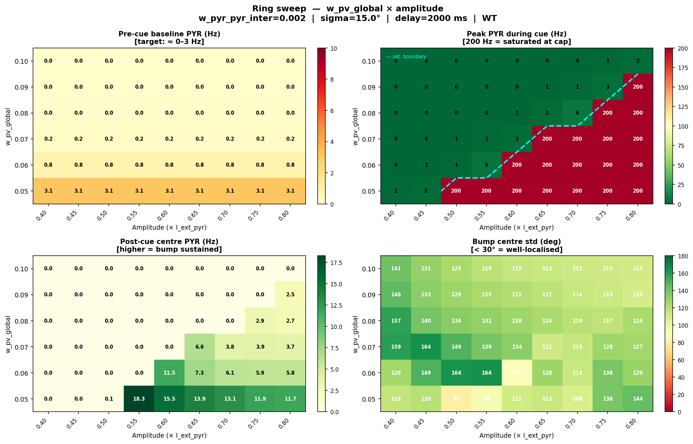
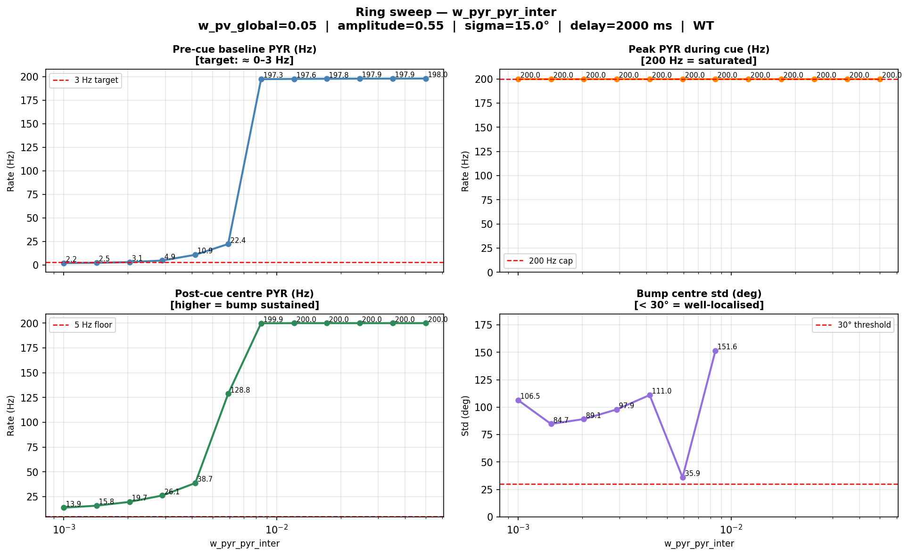
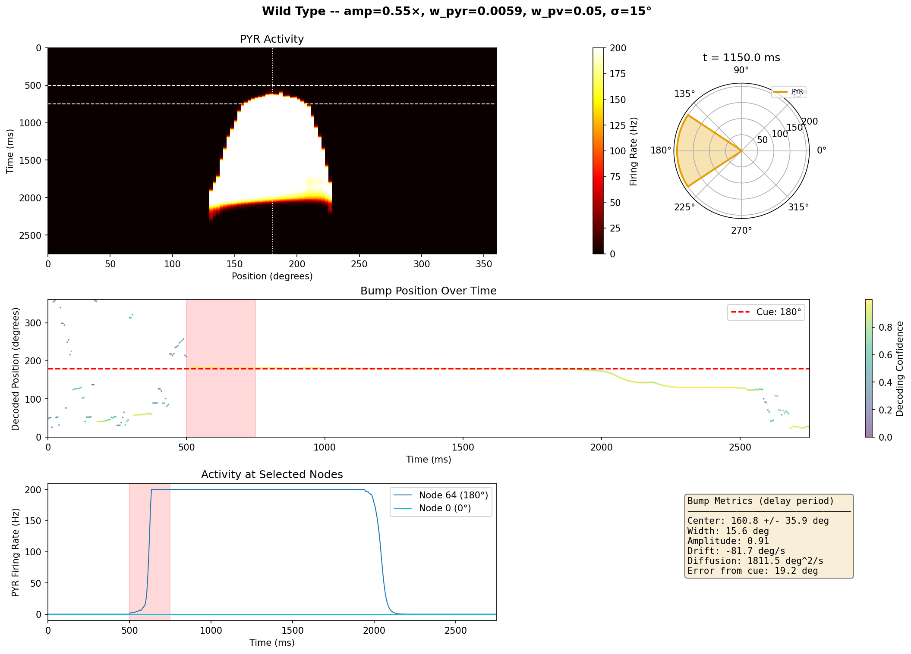

# Ring Network Parameter Sweep: sigma=15° — w_pv_global × amplitude × w_pyr_pyr_inter

## Motivation

The sigma=30° analysis ([ring_wpv_wpyr_sweep.md](ring_wpv_wpyr_sweep.md)) identified the best
operating point at `w_pv_global=0.05, amplitude=0.55, w_pyr_pyr_inter≈0.002`, but the bump
never localised: center_std stayed above 80° across the entire w_pyr_pyr_inter range.

The root hypothesis: with a 30° Gaussian excitation kernel, the recurrent PYR→PYR excitation
is too diffuse to sharpen the bump. Narrowing the kernel to **sigma=15°** concentrates
self-excitation on the bump centre, which should allow the bump to self-sustain in a tighter
region.

**Important connectivity note**: the PYR→PYR weight matrix is **row-sum normalised** to
`w_pyr_pyr_inter`. This means the *total* coupling strength per node is identical at sigma=15°
and sigma=30° under uniform activity. The saturation thresholds (w_pv_global, amplitude) are
therefore expected to remain similar; only the spatial profile of non-uniform states changes.

---

## Circuit parameters

Same as sigma=30° analysis:

| JSON path | I0_pyr | g_gaba_base | Low FP | High FP |
|---|---|---|---|---|
| `figs/optim/bistable_high_fr/best_params.json` | 1.07 | 1.19 | 0 Hz | 78 Hz |

---

## Phases 0–3: pre-cue regime and bistable threshold

Because row-sum normalisation decouples uniform-activity dynamics from sigma, the
w_pv_global and amplitude thresholds are nearly identical to the sigma=30° case.
These phases were reproduced directly from the Phase 4 (2D sweep) results below.

| w_pv_global | amp | baseline | peak_cue | delay_center | center_std | Assessment |
|---|---|---|---|---|---|---|
| 0.05 | 0.40–0.45 | 3.09 Hz | ~1–2 Hz | ~0 Hz | ~118° | Sub-threshold |
| **0.05** | **0.50** | **3.09 Hz** | **200 Hz** | **0.1 Hz** | **81°** | **Just at threshold — bump dies** |
| **0.05** | **0.55** | **3.09 Hz** | **200 Hz** | **18.3 Hz** | **94°** | **Best delay activity** |
| 0.05 | 0.60–0.80 | 3.09 Hz | 200 Hz | 11–15 Hz | >94° | Saturation degrades delay |
| 0.06 | 0.40–0.55 | 0.84 Hz | <5 Hz | ~0 Hz | >149° | Sub-threshold |
| **0.06** | **0.60** | **0.84 Hz** | **200 Hz** | **11.5 Hz** | **92°** | Just above threshold |

**Key observations (consistent with sigma=30°)**:
- `w_pv_global=0.05` keeps pre-cue quiet (~3 Hz).
- Bistable threshold is between amp=0.45 and 0.50 (same as sigma=30°): confirms that the
  bistable jump is governed by uniform-activity dynamics, independent of sigma.
- The "just above threshold" amplitude (0.55) gives the best delay activity, for the same
  reason as before: lower cue-driven saturation → less adaptation surge.

---

## Phase 4 — 2D sweep: w_pv_global × amplitude (sigma=15°)

```bash
python scripts/ring_wpv_amp_sweep.py --sigma_pyr_deg 15 --n_workers 6 --no_show
```



### Results — Phase 4

| w_pv | amp | baseline | peak_cue | delay_center | center_std | Notes |
|---|---|---|---|---|---|---|
| 0.05 | 0.40–0.45 | 3.09 Hz | <2 Hz | ~0 Hz | ~118° | Sub-threshold |
| 0.05 | 0.50 | 3.09 Hz | 200 Hz | 0.1 Hz | 81° | Threshold; bump dies immediately |
| **0.05** | **0.55** | **3.09 Hz** | **200 Hz** | **18.3 Hz** | **94°** | **Global optimum — best delay** |
| 0.05 | 0.60–0.80 | 3.09 Hz | 200 Hz | 11–15 Hz | >94° | Saturation degrades delay |
| **0.06** | **0.60** | **0.84 Hz** | **200 Hz** | **11.5 Hz** | **92°** | Quietest baseline that triggers |
| 0.07 | 0.65 | 0.17 Hz | 200 Hz | 6.6 Hz | 111° | Over-inhibited; weak delay |
| ≥ 0.08 | 0.80 | ~0 Hz | 200 Hz | ~2.5–2.9 Hz | >109° | Barely triggers; weak delay |

**Interpretation:**
- The saturation boundary structure is identical to sigma=30°: it shifts diagonally, requiring
  higher amplitude for higher w_pv_global.
- The best delay activity is again at the **first amplitude just above the bistable threshold**.
- At sigma=15° the best delay (18.3 Hz vs 14.4 Hz at sigma=30°) is slightly higher at the same
  parameters. The center_std at 94° is slightly worse than sigma=30° (83°) at w_pyr=0.002 — the
  narrower kernel does not help localization at this fixed recurrent weight. The bump needs
  stronger recurrent excitation to take advantage of the narrow footprint.

---

## Phase 5 — w_pyr_pyr_inter sweep (sigma=15°)

```bash
python scripts/ring_wpyr_sweep.py --sigma_pyr_deg 15 --w_pv_global 0.05 --amplitude 0.55 --n_workers 6 --no_show
```



### Results — Phase 5

| w_pyr_pyr_inter | baseline | peak_cue | delay_center | center_std | Assessment |
|---|---|---|---|---|---|
| 0.00100 | 2.2 Hz | 200 Hz SAT | 13.9 Hz | 107° | Very diffuse; below bump regime |
| 0.00143 | 2.5 Hz | 200 Hz SAT | 15.8 Hz | **85°** | Best localization at low coupling |
| 0.00204 | 3.1 Hz | 200 Hz SAT | 19.7 Hz | 89° | Better delay; still diffuse |
| 0.00291 | 4.9 Hz | 200 Hz SAT | 26.1 Hz | 98° | Baseline rising; comparable to sigma=30° |
| 0.00415 | 10.9 Hz | 200 Hz SAT | 38.7 Hz | 111° | Pre-cue elevated; bump spreading |
| **0.00592** | **22.4 Hz** | **200 Hz SAT** | **128.8 Hz** | **35.9°** | **Genuine localized bump — qualitative transition** |
| 0.00845 | **197 Hz** | 200 Hz SAT | **200 Hz** | 152° | **Pre-cue saturation cliff** |
| ≥ 0.012 | ~198 Hz | 200 Hz SAT | 200 Hz | — | Fully saturated |

**Dashboard of the best localised run** (`w_pyr_pyr_inter=0.00592`, sigma=15°):



---

### Interpretation

**Qualitative transition at wpyr≈0.006:**

Between `w_pyr_pyr_inter=0.00415` (center_std=111°) and `w_pyr_pyr_inter=0.00592`
(center_std=35.9°), there is a sharp localization transition. This did not occur at
sigma=30°, where the center_std never dropped below 83° and the pre-cue saturation cliff
appeared at the same w_pyr value (~0.008) without any localization.

**Why sigma=15° enables localization:**
- Under uniform activity, sigma has no effect (row-sum normalisation). Both sigma values
  hit the same pre-cue saturation cliff at wpyr≈0.008.
- Under *non-uniform* activity (a partial bump), sigma matters: with sigma=15°, the
  recurrent weight at the bump centre is concentrated on the ~±15° neighbourhood, whereas
  at sigma=30° it is spread over ±30°. This means a nascent bump receives proportionally
  stronger self-excitation at sigma=15°, allowing it to grow without recruiting distant nodes.
- The result: a stable localised bump at wpyr=0.00592 with center_std=35.9°, sustained
  delay firing at 128.8 Hz, and a ring that has not spread to fill the whole network.

**Trade-off:**
- At wpyr=0.00592, pre-cue baseline is 22.4 Hz — elevated compared to the ~3 Hz target.
  This is because the same wpv=0.05 setting, optimized for wpyr=0.002, is slightly too weak
  to fully suppress spontaneous activity at this stronger recurrent coupling.
- A natural follow-up: fix `w_pyr_pyr_inter=0.00592` and re-run a 2D sweep of
  `w_pv_global × amplitude` to find the quietest pre-cue that still triggers a localized bump.

---

## Comparison: sigma=30° vs sigma=15°

| Metric | sigma=30° (best) | sigma=15° (best) |
|---|---|---|
| w_pv_global | 0.05 | 0.05 |
| amplitude | 0.55 | 0.55 |
| w_pyr_pyr_inter | 0.002 | **0.00592** |
| pre-cue baseline | 3.0 Hz | **22.4 Hz** (elevated) |
| delay_center | 14.4 Hz | **128.8 Hz** |
| center_std | 83° | **35.9°** |
| Bump localized? | No | **Yes** (≈ ±18° half-width) |

The sigma=15° kernel unlocks genuine bump localization at the cost of a higher pre-cue
baseline at the Phase 5 optimum. The delay-period firing rate is dramatically stronger
(128.8 vs 14.4 Hz). Both effects reflect the same mechanism: stronger recurrent
self-amplification within a narrow neighbourhood.

---

## Recommended next step

Fix `w_pyr_pyr_inter=0.00592, sigma_pyr_deg=15` and sweep `w_pv_global × amplitude`
to find a regime where:
- Pre-cue baseline ≤ 5 Hz (quiet, as in the sigma=30° best)
- Bistable threshold still crossable by a moderate-amplitude cue
- Delay activity sustained with center_std < 45°

```bash
# To be created: scripts/ring_wpv_amp_sweep_sigma15_wpyr6.py
# or extend the existing script with --w_pyr_pyr_inter argument
```
